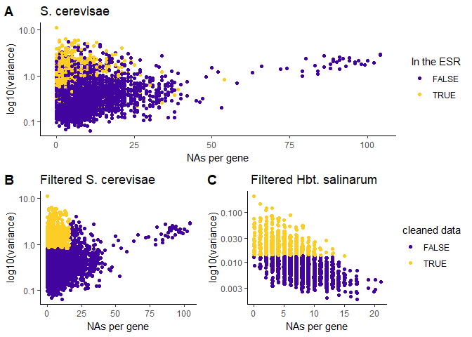

Cleaning data sets
================

Data download and wrangling
---------------------------

Load libraries:

``` r
library(tidyverse)
library(magrittr) 
library(cowplot)
library(viridis)
library(gplots)
library(dendextend)

source("00_custom_functions.R")
```

Load in raw data sets:

``` r
hbt <- read_tsv("http://egrin2.systemsbiology.net/static/Downloads/Expression/hal_exp.txt")

gasch.complete <- read_tsv("http://genome-www.stanford.edu/yeast_stress/data/rawdata/complete_dataset.txt") %>%
  .[,-c(2:3)] 

gasch.fig1 <- read_tsv("http://genome-www.stanford.edu/yeast_stress/data/figure1/figure1.cdt") %>%
  .[-1,] %>%
  .[,-c(1, 3:4)]
```

cluster the 868 genes identified to be a part of the ESR (figure3), use entire data set.

``` r
yeast <- read_tsv("http://genome-www.stanford.edu/yeast_stress/data/rawdata/complete_dataset.txt") %>%
  .[,-c(2:3)]
esr.list <- read_tsv("http://www-genome.stanford.edu/yeast_stress/data/figure3/figure3.cdt") %>%
  .[-1,] %>%
  .[,1]
esr <- yeast[yeast$UID %in% esr.list$UID,]
t.esr <- data.t(esr, esr$UID, scaled = "gene")
esr.cor <- select(t.esr, -cond) %>%
  cor(use = "pairwise.complete.obs")
esr.dist <- as.dist(1-esr.cor)
esr.dend <- as.dendrogram(hclust(esr.dist, method = "complete"))
esr.clusters <- cutree(esr.dend, k=2) %>% 
  data.frame(gene = names(.), cluster = ., row.names = NULL, stringsAsFactors = F)
```

remove unnecessary columns. keep only expt/conditions and gene names

``` r
colnames(hbt)[1] <- "gene"
colnames(gasch.complete)[1] <- "gene"
colnames(gasch.fig1)[1] <- "gene"
```

Check:

``` r
#head(hbt, n=10); head(gasch.complete, n=10)
dim(hbt); dim(gasch.complete)
## [1] 2400 1496
## [1] 6152  174
```

transpose data frames (so that genes are in the columns)

``` r
gasch.w <- data.t(gasch.complete, gasch.complete$gene, scaled = F)
  colnames(gasch.w) <-colnames(gasch.w) %>% str_replace_all(., "\\.", "-")
gasch.1 <- data.t(gasch.fig1, gasch.fig1$gene, scaled = F)
  colnames(gasch.1) <-colnames(gasch.1) %>% str_replace_all(., "\\.", "-")
hbt.w <- data.t(hbt, hbt$gene, scaled = F)
```

get data into long format

``` r
gasch.long <- gather(gasch.w, gene, expression, -cond)
gasch1.long <- gather(gasch.1, gene, expression, -cond)
hbt.long <- gather(hbt.w, gene, expression, -cond)

var.check(gasch.long); var.check(hbt.long)
## [1] "0 have variance of zero. The range of variances is 0.0638 to 11.2871"
## [1] "0 have variance of zero. The range of variances is 0.0018 to 0.21"
```

changing 0 to NA does not affect variance

    ## [1] "0 have variance of zero. The range of variances is 0.0653 to 11.2871"
    ## [1] "0 have variance of zero. The range of variances is 0.0018 to 0.21"

``` r
#S. cer
head(gasch.long)
##                         cond    gene expression
## 1 Heat Shock 05 minutes hs-1 YAL001C       1.53
## 2 Heat Shock 10 minutes hs-1 YAL001C      -0.06
## 3 Heat Shock 15 minutes hs-1 YAL001C       0.58
## 4 Heat Shock 20 minutes hs-1 YAL001C       0.52
## 5 Heat Shock 30 minutes hs-1 YAL001C       0.42
## 6 Heat Shock 40 minutes hs-1 YAL001C       0.16
#Hbt. sal
head(hbt.long)
##                            cond     gene expression
## 1 light2__1440m_vs_light1_3960m VNG0001H     -0.265
## 2 light2__1620m_vs_light1_3960m VNG0001H     -0.564
## 3 light2__1800m_vs_light1_3960m VNG0001H     -0.124
## 4 light2__1980m_vs_light1_3960m VNG0001H     -0.143
## 5 light2__2160m_vs_light1_3960m VNG0001H     -0.284
## 6 light2__2340m_vs_light1_3960m VNG0001H     -0.277
```

Wrangling complete.

Data filtering
--------------

To clean:
1. keep genes whose expression has been detected in at least 90% of the conditions
2. keep the 1000 genes with the highest expression variance across conditions

get variances and missing value distributions of wrangled data:

``` r
gasch.long %>% 
  group_by(gene) %>% 
  summarise(na.count = sum(is.na(expression))) -> gasch.nacounts
gasch.long %>% 
  group_by(gene) %>% 
  summarise(var = var(expression, na.rm = TRUE)) -> gasch.var

merge(gasch.nacounts, gasch.var, key = gene) -> combined.g

gasch1.long %>% 
  group_by(gene) %>% 
  summarise(na.count = sum(is.na(expression))) -> gasch1.nacounts
gasch1.long %>% 
  group_by(gene) %>% 
  summarise(var = var(expression, na.rm = TRUE)) -> gasch1.var

merge(gasch1.nacounts, gasch1.var, key = gene) -> combined.g1

hbt.long %>% 
  group_by(gene) %>% 
  summarise(na.count = sum(is.na(expression))) -> hbt.nacounts
hbt.long %>% 
  group_by(gene) %>% 
  summarise(var = var(expression, na.rm = TRUE)) -> hbt.var

merge(hbt.nacounts, hbt.var, key = gene) -> combined.hbt
```

genes that were measured in 90% of tested conditions:

    ## [1] "5618 genes pass cutoff. 534 were removed"
    ## [1] "5205 genes pass cutoff. 947 were removed"
    ## [1] "2400 genes pass cutoff. 0 were removed"

filter variance genes by those in the 90th percentile, and take 1000 most variable genes

``` r
clean.gasch <- gasch.complete[gasch.complete$gene %in% gasch.present90,]
clean.gasch1 <- gasch.fig1[gasch.fig1$gene %in% gasch1.present90,]
clean.hbt <- hbt[hbt$gene %in% hbt.present90,]

dim(clean.gasch); dim(clean.hbt); dim(clean.gasch1)
## [1] 5618  174
## [1] 2400 1496
## [1] 5205  106
```

``` r
gasch.1000var <- gasch.var[gasch.var$gene %in% gasch.present90,] %>% 
  var.cutoff(., 1000, return.list = T)
gasch.1000var <- gasch.complete[gasch.complete$gene %in% gasch.1000var,]

gasch1.1000var <- gasch1.var[gasch1.var$gene %in% gasch1.present90,] %>% 
  var.cutoff(., 1000, return.list = T)
gasch1.1000var <- gasch.fig1[gasch.fig1$gene %in% gasch1.1000var,]

hbt.1000var <- hbt.var[hbt.var$gene %in% hbt.present90,] %>% 
  var.cutoff(., 1000, return.list = T)
hbt.1000var <- hbt[hbt$gene %in% hbt.1000var,]

#dim(gasch.1000var); dim(hbt.1000var)
```

Filtering perspectives and export
---------------------------------

How many ESR genes are in each cluster?

    ## # A tibble: 2 x 2
    ##   cluster     n
    ##     <int> <int>
    ## 1       1   585
    ## 2       2   283

How many ESR genes are present after each filtering step?
after 90% observation:

    ## [1] 837

after taking the 1000 most variable genes:

    ## [1] 571

visualize the Gasch ESR subset relative to the raw data, and the subset of data we filtered. 

Figure shows in yellow the genes that were identified as ESR in Gasch et al. (A), or genes that passed our filtering requirements and were considered for the analysis discussed in this review.

#### Export cleaned data for enrichment and clustering:

``` r
write_csv(esr.clusters, "../output/clustered_genelists/esrclusters.csv") 

write_csv(hbt, "../output/cleaned_data/hbt_total.csv")
write_csv(clean.hbt, "../output/cleaned_data/hbt_present90percent.csv")
write_csv(hbt.1000var, "../output/cleaned_data/hbt_1000_var.csv")

write_csv(gasch.complete, "../output/cleaned_data/gasch_total.csv")
write_csv(clean.gasch, "../output/cleaned_data/gasch_present90percent.csv")
write_csv(gasch.1000var, "../output/cleaned_data/gasch_1000_var.csv")

#write_csv(clean.gasch1, "../output/cleaned_data/gasch_fig1_present90percent.csv")
#write_csv(gasch1.1000var, "../output/cleaned_data/gasch_fig1_1000_var.csv")
```

``` r
tiff("../output/figures/supplemental_fig1.tiff", height = 800, width = 800)
plot(clean.graph)
dev.off()
```
