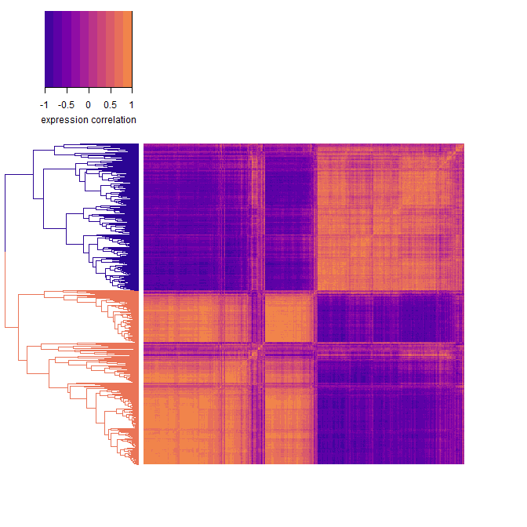
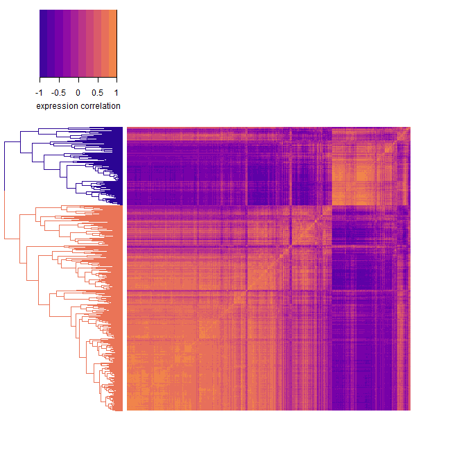
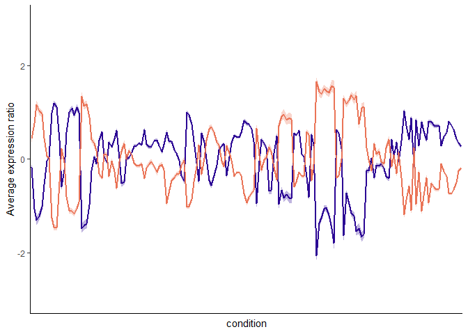
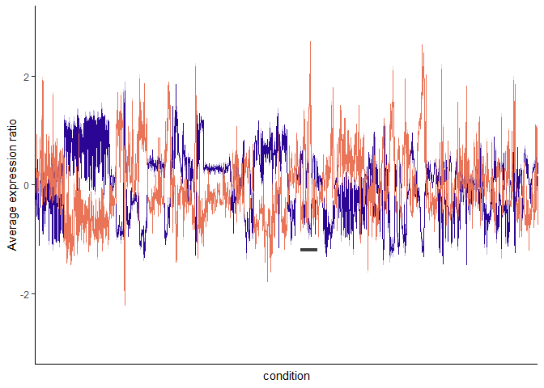
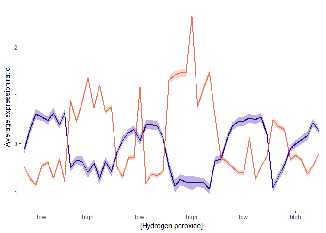

01\_cluster\_genes\_expression
================

This notebook clusters expression data sets into two clusters and exports gene lists of those clusters. It also produces the panels in Figure 1 or the review.

``` r
library(tidyverse); library(dplyr); library(dendextend)
library(viridis); library(gplots); library(scales)

source("00_custom_functions.R")

#load files:
yeast00 <- read_csv("../output/cleaned_data/gasch_1000_var.csv")
hbt07 <- read_csv("../output/cleaned_data/hbt_1000_var.csv")
esr <- read_csv("../output/clustered_genelists/esrclusters.csv")

dim(yeast00);dim(hbt07)
## [1] 1000  174
## [1] 1000 1496
```

Transform data:

``` r
t.yeast00 <- data.t(yeast00, yeast00$gene, scaled = "gene")
colnames(t.yeast00) <-  colnames(t.yeast00) %>% str_replace_all(., "\\.", "-")
t.hbt07 <- data.t(hbt07, hbt07$gene, scaled = "gene")
```

Gene-by-gene correlations
-------------------------

create correlation and distance matrices

``` r
set.seed(123)
yeast.cor <- select(t.yeast00, -cond) %>% cor(use = "pairwise.complete.obs")
yeast.dist <- as.dist(1-yeast.cor)

hbt.cor <- select(t.hbt07, -cond) %>% cor(use = "pairwise.complete.obs")
hbt.dist <- as.dist(1-hbt.cor)
```

make dendrograms

``` r
yeast.dend <- as.dendrogram(hclust(yeast.dist, method = "complete"))
hbt.dend <- as.dendrogram(hclust(hbt.dist, method = "complete"))
```

### Plot correlation matrices.

#### S.cer gene-by-gene correlation:

``` r
tmp <- color_branches(yeast.dend, k=2, col = plasma(2, begin = 0.05, end = 0.65)) 

heatmap.2(yeast.cor, Rowv = ladderize(tmp), Colv = ladderize(tmp),
          dendrogram = "row", 
          col = plasma(10, begin = 0.1, end = 0.7), 
          trace = "none", density.info = "none",
          labRow = FALSE, labCol = FALSE,
          key.title = NA,
          key.xlab = "expression correlation")
```



#### Halobacterium gene-by-gene correlation:

``` r
tmp <- color_branches(hbt.dend, k=2, col = plasma(2, begin = 0.05, end = 0.65)) 

heatmap.2(hbt.cor, Rowv = ladderize(tmp), Colv = ladderize(tmp),
          dendrogram = "row", 
          col = plasma(10, begin = 0.1, end = 0.7), 
          trace = "none", density.info = "none",
          labRow = FALSE, labCol = FALSE,
          key.title = NA,
          key.xlab = "expression correlation")
```



### Split the correlated genes into two clusters

get gene lists of the 2 clusters for each data set and export for NOG analysis.

``` r
clusters.yeast <- cutree(yeast.dend, k=2) %>% 
  data.frame(gene = names(.), cluster = ., row.names = NULL, stringsAsFactors = F)
clusters.hbt2 <- cutree(hbt.dend, k=2) %>% 
  data.frame(gene = names(.), cluster = ., row.names = NULL, stringsAsFactors = F)
```

(splitting halobacterium into 3 clusters splits cluster 1 into 2 clusters)

wide to long format for later analysis:

``` r
yeast.long <- gather(t.yeast00, gene, expression, -cond)
hbt.long <- gather(t.hbt07, gene, expression, -cond)

#set 0 to NA
yeast.long[yeast.long == 0] <- NA
hbt.long[hbt.long == 0] <- NA
```

Average Expression across conditons
-----------------------------------

This is where the scaling becomes important/apparent. Selected scaling by genes, as it scaled the range of expression, to facilitate comparison between S. cer and Hbt. sal, but did not affect apparent dynamics or between gene comparisons. This is illustrated in the scaling vignette on the github repository. Scaling dose not effect clustering, though it affects the correlation of the two Hbt. sal clusters slightly (-0.78 to -0.76).

#### Calculate average expression for each gene

use cluster information to filter expression data. Mean of all gene expression across conditions:

``` r
ex.yeast <- full_join(clusters.yeast, yeast.long, by = "gene")
ex.yeast[is.na(ex.yeast)] <- 0

#get mean expression by conditon for clusters and overall
ex.yeast %>%
  group_by(cluster, cond) %>%
  summarise(rep = length(expression), avg_expression = mean(expression),
            CI95 = conf_int95(expression)) -> y.avg.ex

#order by condition clusters
y.cond.cor <- select(yeast00, -gene) %>% cor(use = "pairwise.complete.obs")
order.dendrogram(make.dend(y.cond.cor))->idx
labels(make.dend(y.cond.cor))->tmp
y.cond<-tmp[order(idx)]

ex.hbt <- full_join(clusters.hbt2, hbt.long, by = "gene")
ex.hbt[is.na(ex.hbt)] <- 0

#get mean expression by conditon for clusters and overall
ex.hbt %>%
  group_by(cluster, cond) %>%
  summarise(rep = length(expression), avg_expression = mean(expression),
            CI95 = conf_int95(expression)) -> hbt.avg.ex

#make ratio of avg expression
#hbt.cluster1$ratio <- hbt.cluster1$avg_expression / hbt.all$avg_expression
#hbt.cluster2$ratio <- hbt.cluster2$avg_expression / hbt.all$avg_expression

#order by condition clusters
hbt.cond.cor <- select(hbt07, -gene) %>% cor(use = "pairwise.complete.obs")
order.dendrogram(make.dend(hbt.cond.cor))->idx
labels(make.dend(hbt.cond.cor))->tmp
hbt.cond<-tmp[order(desc(idx))]
```

Yeast entire data set:


Halobacterium entire data set:

get window for hydrogen peroxide inset of hbt

``` r
hbt.avg.ex[hbt.avg.ex$cond %in% str_subset(hbt.avg.ex$cond, "H2O2.*Rec"),]$cond -> h2o2
condition <- "H2O2.*Rec"
#which(hbt.avg.ex$cond %in% h2o2)
```



Halobacterium expression during treatment with hydrogen peroxide:


How correlated ARE the two clusters?
------------------------------------

calculate spearman's rho correlation efficient for the gene clusters:

    ## 
    ##  Spearman's rank correlation rho
    ## 
    ## data:  filter(y.avg.ex, cluster == 1)$avg_expression and filter(y.avg.ex, cluster == 2)$avg_expression
    ## S = 1681400, p-value < 2.2e-16
    ## alternative hypothesis: true rho is not equal to 0
    ## sample estimates:
    ##        rho 
    ## -0.9485007
    ## Warning in cor.test.default(filter(hbt.avg.ex, cluster ==
    ## 1)$avg_expression, : Cannot compute exact p-value with ties
    ## 
    ##  Spearman's rank correlation rho
    ## 
    ## data:  filter(hbt.avg.ex, cluster == 1)$avg_expression and filter(hbt.avg.ex, cluster == 2)$avg_expression
    ## S = 981280000, p-value < 2.2e-16
    ## alternative hypothesis: true rho is not equal to 0
    ## sample estimates:
    ##        rho 
    ## -0.7620583

get the same result using rcorr function:

``` r
#library(Hmisc)
#tmp <- cbind(filter(y.avg.ex, cluster == 1)$avg_expression, filter(y.avg.ex, cluster == 2)$avg_expression)
#rcorr(tmp, type = "spearman")
#tmp <- cbind(filter(hbt.avg.ex, cluster == 1)$avg_expression, filter(hbt.avg.ex, cluster == 2)$avg_expression)
#rcorr(tmp, type = "spearman")
```

Which cluster is induced or repressed?
--------------------------------------

``` r
#Hbt sal
hbt.avg.ex %>%
  group_by(cluster) %>%
  summarise(avg = mean(avg_expression), reps = mean(rep))
## # A tibble: 2 x 3
##   cluster       avg  reps
##     <int>     <dbl> <dbl>
## 1       1 -7.85e-19   276
## 2       2  1.30e-18   724

#S. cer
esr %>%
  group_by(cluster) %>%
  tally()
## # A tibble: 2 x 2
##   cluster     n
##     <dbl> <int>
## 1       1   585
## 2       2   283

clusters.yeast[clusters.yeast$gene %in% filter(esr, cluster == 2)$gene,]
##        gene cluster
## 6   YAL061W       2
## 20  YBL049W       2
## 22  YBL064C       2
## 24  YBL075C       2
## 29  YBR006W       2
## 39  YBR052C       2
## 40  YBR053C       2
## 42  YBR056W       2
## 46  YBR072W       2
## 55  YBR126C       2
## 57  YBR139W       2
## 61  YBR183W       2
## 66  YBR230C       2
## 74  YBR269C       2
## 76  YBR285W       2
## 83  YCL035C       2
## 85  YCL040W       2
## 86  YCL042W       2
## 99  YCR061W       2
## 101 YCR091W       2
## 106 YDL021W       2
## 107 YDL022W       2
## 108 YDL023C       2
## 119 YDL110C       2
## 120 YDL124W       2
## 128 YDL199C       2
## 129 YDL204W       2
## 131 YDL222C       2
## 133 YDR001C       2
## 139 YDR032C       2
## 145 YDR059C       2
## 147 YDR070C       2
## 148 YDR074W       2
## 151 YDR085C       2
## 154 YDR096W       2
## 163 YDR171W       2
## 166 YDR204W       2
## 173 YDR258C       2
## 186 YDR358W       2
## 189 YDR380W       2
## 198 YDR453C       2
## 206 YDR513W       2
## 207 YDR516C       2
## 210 YEL011W       2
## 211 YEL012W       2
## 214 YEL039C       2
## 218 YEL060C       2
## 225 YER037W       2
## 229 YER053C       2
## 239 YER079W       2
## 246 YER103W       2
## 254 YER150W       2
## 255 YER158C       2
## 258 YFL014W       2
## 271 YFR053C       2
## 276 YGL037C       2
## 281 YGL096W       2
## 287 YGL121C       2
## 292 YGL156W       2
## 297 YGL180W       2
## 304 YGL208W       2
## 307 YGL248W       2
## 311 YGR008C       2
## 312 YGR019W       2
## 315 YGR043C       2
## 322 YGR088W       2
## 337 YGR161C       2
## 343 YGR194C       2
## 344 YGR201C       2
## 345 YGR209C       2
## 353 YGR248W       2
## 355 YGR250C       2
## 356 YGR256W       2
## 368 YHL021C       2
## 386 YHR087W       2
## 390 YHR096C       2
## 391 YHR097C       2
## 392 YHR104W       2
## 394 YHR137W       2
## 395 YHR138C       2
## 416 YIL045W       2
## 423 YIL097W       2
## 424 YIL099W       2
## 425 YIL101C       2
## 426 YIL107C       2
## 428 YIL113W       2
## 433 YIL136W       2
## 447 YIR038C       2
## 448 YIR039C       2
## 451 YJL048C       2
## 452 YJL057C       2
## 453 YJL066C       2
## 458 YJL103C       2
## 465 YJL141C       2
## 466 YJL142C       2
## 467 YJL144W       2
## 470 YJL155C       2
## 473 YJL161W       2
## 474 YJL163C       2
## 475 YJL164C       2
## 487 YJR008W       2
## 499 YJR096W       2
## 509 YKL026C       2
## 511 YKL035W       2
## 521 YKL091C       2
## 522 YKL093W       2
## 525 YKL103C       2
## 529 YKL142W       2
## 531 YKL150W       2
## 532 YKL151C       2
## 539 YKL188C       2
## 544 YKR009C       2
## 545 YKR011C       2
## 553 YKR058W       2
## 556 YKR066C       2
## 557 YKR067W       2
## 558 YKR076W       2
## 566 YLL020C       2
## 568 YLL026W       2
## 570 YLL039C       2
## 592 YLR080W       2
## 600 YLR142W       2
## 601 YLR149C       2
## 603 YLR152C       2
## 611 YLR178C       2
## 626 YLR251W       2
## 627 YLR252W       2
## 628 YLR258W       2
## 631 YLR267W       2
## 632 YLR270W       2
## 638 YLR299W       2
## 643 YLR312C       2
## 646 YLR327C       2
## 653 YLR356W       2
## 674 YML042W       2
## 685 YML100W       2
## 689 YML128C       2
## 691 YML131W       2
## 698 YMR081C       2
## 699 YMR090W       2
## 703 YMR105C       2
## 705 YMR110C       2
## 712 YMR136W       2
## 714 YMR169C       2
## 715 YMR173W       2
## 717 YMR174C       2
## 719 YMR181C       2
## 724 YMR196W       2
## 736 YMR250W       2
## 737 YMR251W       2
## 741 YMR271C       2
## 743 YMR291W       2
## 749 YMR315W       2
## 755 YNL009W       2
## 756 YNL015W       2
## 759 YNL055C       2
## 775 YNL115C       2
## 781 YNL134C       2
## 783 YNL160W       2
## 789 YNL194C       2
## 790 YNL195C       2
## 791 YNL200C       2
## 794 YNL208W       1
## 801 YNL274C       2
## 805 YNL305C       2
## 810 YNR002C       2
## 825 YOL048C       2
## 829 YOL082W       2
## 830 YOL083W       2
## 831 YOL084W       2
## 838 YOL150C       2
## 839 YOL151W       2
## 841 YOL153C       2
## 855 YOR052C       2
## 873 YOR152C       2
## 875 YOR161C       2
## 877 YOR173W       2
## 879 YOR185C       2
## 885 YOR220W       2
## 895 YOR289W       2
## 904 YOR317W       2
## 908 YOR374W       2
## 914 YPL004C       2
## 921 YPL054W       2
## 927 YPL087W       2
## 941 YPL165C       2
## 942 YPL166W       2
## 945 YPL186C       2
## 956 YPL230W       2
## 972 YPR026W       2
## 991 YPR149W       2
## 992 YPR150W       2
## 993 YPR151C       2
## 998 YPR184W       2
clusters.yeast[clusters.yeast$gene %in% filter(esr, cluster == 1)$gene,]
##        gene cluster
## 1   YAL003W       1
## 8   YAR073W       1
## 9   YAR075W       1
## 12  YBL024W       1
## 13  YBL027W       1
## 14  YBL028C       1
## 15  YBL039C       1
## 21  YBL054W       1
## 23  YBL072C       1
## 25  YBL077W       1
## 26  YBL087C       1
## 27  YBL092W       1
## 32  YBR031W       1
## 33  YBR034C       1
## 36  YBR048W       1
## 47  YBR079C       1
## 51  YBR106W       1
## 54  YBR121C       1
## 58  YBR154C       1
## 60  YBR181C       1
## 62  YBR189W       1
## 63  YBR191W       1
## 67  YBR238C       1
## 70  YBR247C       1
## 71  YBR249C       1
## 72  YBR266C       1
## 73  YBR267W       1
## 84  YCL037C       1
## 87  YCL054W       1
## 88  YCL059C       1
## 94  YCR016W       1
## 96  YCR031C       1
## 97  YCR034W       1
## 98  YCR057C       1
## 100 YCR072C       1
## 111 YDL051W       1
## 112 YDL061C       1
## 113 YDL062W       1
## 114 YDL063C       1
## 115 YDL075W       1
## 116 YDL081C       1
## 117 YDL082W       1
## 118 YDL083C       1
## 122 YDL153C       1
## 123 YDL167C       1
## 127 YDL191W       1
## 134 YDR012W       1
## 137 YDR023W       1
## 138 YDR025W       1
## 141 YDR037W       1
## 146 YDR064W       1
## 150 YDR083W       1
## 152 YDR087C       1
## 153 YDR091C       1
## 155 YDR101C       1
## 158 YDR120C       1
## 162 YDR165W       1
## 165 YDR184C       1
## 178 YDR312W       1
## 180 YDR321W       1
## 181 YDR324C       1
## 182 YDR341C       1
## 187 YDR361C       1
## 188 YDR365C       1
## 190 YDR382W       1
## 192 YDR385W       1
## 193 YDR398W       1
## 195 YDR412W       1
## 196 YDR417C       1
## 197 YDR450W       1
## 199 YDR465C       1
## 200 YDR471W       1
## 202 YDR496C       1
## 203 YDR500C       1
## 213 YEL026W       1
## 215 YEL040W       1
## 216 YEL042W       1
## 217 YEL054C       1
## 221 YER006W       1
## 223 YER025W       1
## 224 YER036C       1
## 226 YER043C       1
## 227 YER049W       1
## 237 YER070W       1
## 238 YER074W       1
## 245 YER102W       1
## 247 YER110C       1
## 248 YER117W       1
## 251 YER126C       1
## 252 YER127W       1
## 253 YER131W       1
## 261 YFL045C       1
## 266 YFR001W       1
## 272 YGL008C       1
## 273 YGL029W       1
## 274 YGL030W       1
## 275 YGL031C       1
## 279 YGL076C       1
## 280 YGL078C       1
## 282 YGL099W       1
## 283 YGL102C       1
## 284 YGL103W       1
## 285 YGL111W       1
## 286 YGL120C       1
## 288 YGL123W       1
## 289 YGL135W       1
## 290 YGL147C       1
## 291 YGL148W       1
## 295 YGL171W       1
## 313 YGR027C       1
## 314 YGR034W       1
## 321 YGR085C       1
## 323 YGR094W       1
## 325 YGR118W       1
## 326 YGR123C       1
## 327 YGR124W       1
## 328 YGR128C       1
## 332 YGR145W       1
## 334 YGR148C       1
## 336 YGR160W       1
## 338 YGR162W       1
## 341 YGR185C       1
## 342 YGR187C       1
## 346 YGR214W       1
## 352 YGR245C       1
## 357 YGR264C       1
## 358 YGR265W       1
## 359 YGR272C       1
## 360 YGR280C       1
## 361 YGR285C       1
## 364 YHL001W       1
## 365 YHL011C       1
## 371 YHL033C       1
## 373 YHR010W       1
## 374 YHR019C       1
## 375 YHR020W       1
## 376 YHR021C       1
## 379 YHR052W       1
## 382 YHR064C       1
## 383 YHR065C       1
## 384 YHR066W       1
## 385 YHR068W       1
## 387 YHR088W       1
## 388 YHR089C       1
## 393 YHR128W       1
## 398 YHR141C       1
## 400 YHR148W       1
## 402 YHR169W       1
## 403 YHR170W       1
## 405 YHR196W       1
## 406 YHR197W       1
## 407 YHR203C       1
## 411 YHR216W       1
## 413 YIL018W       1
## 414 YIL019W       1
## 418 YIL052C       1
## 421 YIL078W       1
## 431 YIL127C       1
## 432 YIL133C       1
## 437 YIR012W       1
## 440 YIR026C       1
## 454 YJL069C       1
## 456 YJL080C       1
## 460 YJL109C       1
## 462 YJL122W       1
## 463 YJL136C       1
## 464 YJL138C       1
## 468 YJL148W       1
## 477 YJL177W       1
## 479 YJL188C       1
## 480 YJL189W       1
## 481 YJL190C       1
## 485 YJR002W       1
## 486 YJR007W       1
## 492 YJR041C       1
## 494 YJR063W       1
## 495 YJR070C       1
## 496 YJR071W       1
## 501 YJR123W       1
## 502 YJR143C       1
## 503 YJR145C       1
## 507 YKL006W       1
## 508 YKL009W       1
## 514 YKL056C       1
## 517 YKL078W       1
## 518 YKL081W       1
## 519 YKL082C       1
## 524 YKL099C       1
## 534 YKL172W       1
## 536 YKL180W       1
## 537 YKL181W       1
## 547 YKR024C       1
## 551 YKR056W       1
## 552 YKR057W       1
## 554 YKR059W       1
## 555 YKR060W       1
## 559 YKR081C       1
## 561 YKR092C       1
## 562 YKR094C       1
## 564 YLL008W       1
## 565 YLL011W       1
## 569 YLL035W       1
## 572 YLL044W       1
## 573 YLL045C       1
## 576 YLR002C       1
## 577 YLR003C       1
## 578 YLR009W       1
## 579 YLR029C       1
## 581 YLR044C       1
## 582 YLR048W       1
## 586 YLR060W       1
## 587 YLR061W       1
## 588 YLR062C       1
## 589 YLR074C       1
## 590 YLR075W       1
## 591 YLR076C       1
## 594 YLR083C       1
## 598 YLR134W       1
## 602 YLR150W       1
## 608 YLR167W       1
## 610 YLR175W       1
## 613 YLR183C       1
## 614 YLR185W       1
## 615 YLR186W       1
## 617 YLR196W       1
## 618 YLR197W       1
## 619 YLR198C       1
## 623 YLR221C       1
## 624 YLR222C       1
## 625 YLR249W       1
## 630 YLR264W       1
## 633 YLR276C       1
## 636 YLR293C       1
## 645 YLR325C       1
## 647 YLR333C       1
## 648 YLR339C       1
## 649 YLR340W       1
## 650 YLR344W       1
## 655 YLR367W       1
## 656 YLR372W       1
## 658 YLR388W       1
## 659 YLR401C       1
## 660 YLR409C       1
## 661 YLR413W       1
## 662 YLR432W       1
## 663 YLR435W       1
## 665 YLR448W       1
## 666 YLR449W       1
## 669 YML022W       1
## 670 YML024W       1
## 671 YML026C       1
## 675 YML043C       1
## 678 YML056C       1
## 679 YML063W       1
## 681 YML073C       1
## 682 YML080W       1
## 684 YML093W       1
## 692 YMR014W       1
## 696 YMR049C       1
## 700 YMR093W       1
## 707 YMR116C       1
## 710 YMR121C       1
## 711 YMR131C       1
## 713 YMR142C       1
## 722 YMR194W       1
## 727 YMR215W       1
## 728 YMR217W       1
## 729 YMR229C       1
## 730 YMR230W       1
## 731 YMR235C       1
## 732 YMR239C       1
## 734 YMR242C       1
## 742 YMR290C       1
## 746 YMR307W       1
## 747 YMR309C       1
## 748 YMR310C       1
## 751 YMR321C       1
## 753 YNL002C       1
## 760 YNL061W       1
## 761 YNL062C       1
## 763 YNL066W       1
## 764 YNL067W       1
## 765 YNL069C       1
## 766 YNL075W       1
## 770 YNL096C       1
## 771 YNL110C       1
## 773 YNL113W       1
## 774 YNL114C       1
## 777 YNL119W       1
## 780 YNL132W       1
## 782 YNL141W       1
## 784 YNL162W       1
## 785 YNL174W       1
## 786 YNL175C       1
## 787 YNL178W       1
## 788 YNL182C       1
## 795 YNL209W       1
## 798 YNL247W       1
## 799 YNL248C       1
## 800 YNL255C       1
## 804 YNL301C       1
## 806 YNL308C       1
## 807 YNL313C       1
## 813 YNR043W       1
## 816 YNR053C       1
## 821 YOL039W       1
## 822 YOL040C       1
## 823 YOL041C       1
## 828 YOL077C       1
## 832 YOL097C       1
## 833 YOL120C       1
## 834 YOL121C       1
## 835 YOL124C       1
## 837 YOL127W       1
## 846 YOR004W       1
## 857 YOR063W       1
## 859 YOR095C       1
## 860 YOR096W       1
## 871 YOR145C       1
## 872 YOR146W       1
## 876 YOR167C       1
## 882 YOR206W       1
## 886 YOR224C       1
## 887 YOR234C       1
## 889 YOR243C       1
## 892 YOR272W       1
## 894 YOR287C       1
## 896 YOR293W       1
## 897 YOR294W       1
## 899 YOR309C       1
## 900 YOR310C       1
## 901 YOR312C       1
## 907 YOR369C       1
## 918 YPL037C       1
## 919 YPL043W       1
## 920 YPL044C       1
## 924 YPL079W       1
## 925 YPL081W       1
## 926 YPL086C       1
## 929 YPL090C       1
## 935 YPL142C       1
## 936 YPL143W       1
## 937 YPL146C       1
## 939 YPL160W       1
## 943 YPL183C       1
## 946 YPL198W       1
## 948 YPL207W       1
## 949 YPL211W       1
## 950 YPL212C       1
## 951 YPL217C       1
## 952 YPL220W       1
## 954 YPL226W       1
## 957 YPL237W       1
## 958 YPL238C       1
## 964 YPL266W       1
## 965 YPL273W       1
## 971 YPR010C       1
## 974 YPR033C       1
## 976 YPR043W       1
## 977 YPR044C       1
## 978 YPR060C       1
## 980 YPR074C       1
## 981 YPR102C       1
## 982 YPR110C       1
## 983 YPR112C       1
## 984 YPR118W       1
## 986 YPR132W       1
## 987 YPR142C       1
## 988 YPR143W       1
## 989 YPR144C       1
## 990 YPR145W       1
## 996 YPR163C       1
```

in Hbt. cluster 1 is repressed on average and corresponds to the purple cluster in the heatmap dendrogram. scer cluster 2 contains iESR genes and cluster 1 contains rESR genes

Export files
------------

Write out cluster gene lists

``` r
write_csv(clusters.yeast, "../output/clustered_genelists/yeast2clusters.csv")
write_csv(clusters.hbt2, "../output/clustered_genelists/hbt2clusters.csv")
```

plot heat maps!

``` r
png("../output/figures/Figure1_panels/scer.2clust.png", height = 1000, width = 1000)
heat.plus.dend(yeast.cor, yeast.dend)
dev.off()

png("../output/figures/Figure1_panels/hbt.2clust.png", height = 1000, width = 1000)
heat.plus.dend(hbt.cor, hbt.dend)
dev.off()
```
