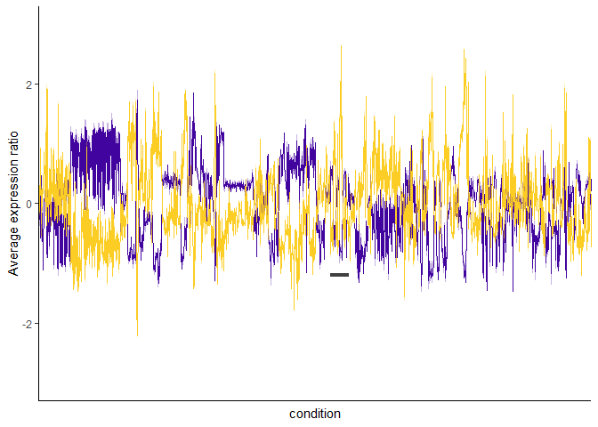

01\_cluster\_genes\_expression
================

This notebook clusters expression data sets into two clusters and exports gene lists of those clusters. It also produces the panels in Figure 1 or the review.

``` r
library(tidyverse); library(dplyr); library(dendextend)
library(viridis); library(gplots); library(scales)

source("00_custom_functions.R")

#load files:
yeast00 <- read_csv("../output/cleaned_data/gasch_1000_var.csv")
hbt07 <- read_csv("../output/cleaned_data/hbt_1000_var.csv")

dim(yeast00);dim(hbt07)
## [1] 1000  174
## [1] 1000 1496
```

Transform data:

``` r
t.yeast00 <- data.t(yeast00, yeast00$gene, scaled = "gene")
colnames(t.yeast00) <-  colnames(t.yeast00) %>% str_replace_all(., "\\.", "-")
t.hbt07 <- data.t(hbt07, hbt07$gene, scaled = "gene")
```

Gene-by-gene correlations
-------------------------

create correlation and distance matrices

``` r
set.seed(123)
yeast.cor <- select(t.yeast00, -cond) %>% cor(use = "pairwise.complete.obs")
yeast.dist <- as.dist(1-yeast.cor)

hbt.cor <- select(t.hbt07, -cond) %>% cor(use = "pairwise.complete.obs")
hbt.dist <- as.dist(1-hbt.cor)
```

make dendrograms

``` r
yeast.dend <- as.dendrogram(hclust(yeast.dist, method = "complete"))
hbt.dend <- as.dendrogram(hclust(hbt.dist, method = "complete"))
```

### Plot correlation matrices.

#### S.cer gene-by-gene correlation:

``` r
tmp <- color_branches(yeast.dend, k=2, col = plasma(2, begin = 0.1, end = 0.9)) 

heatmap.2(yeast.cor, Rowv = ladderize(tmp), Colv = ladderize(tmp),
          dendrogram = "row", 
          col = plasma(15, begin = 0.1, end = 0.9), 
          trace = "none", density.info = "none",
          labRow = FALSE, labCol = FALSE,
          key.title = NA,
          key.xlab = "expression correlation")
```


#### Halobacterium gene-by-gene correlation:

``` r
tmp <- color_branches(hbt.dend, k=2, col = plasma(2, begin = 0.1, end = 0.9)) 

heatmap.2(hbt.cor, Rowv = ladderize(tmp), Colv = ladderize(tmp),
          dendrogram = "row", 
          col = plasma(15, begin = 0.1, end = 0.9), 
          trace = "none", density.info = "none",
          labRow = FALSE, labCol = FALSE,
          key.title = NA,
          key.xlab = "expression correlation")
```


### Split the correlated genes into two clusters

get gene lists of the 2 clusters for each data set and export for NOG analysis.

``` r
clusters.yeast <- cutree(yeast.dend, k=2) %>% 
  data.frame(gene = names(.), cluster = ., row.names = NULL, stringsAsFactors = F)
clusters.hbt2 <- cutree(hbt.dend, k=2) %>% 
  data.frame(gene = names(.), cluster = ., row.names = NULL, stringsAsFactors = F)
```

(splitting halobacterium into 3 clusters splits cluster 1 into 2 clusters)

wide to long format for later analysis:

``` r
yeast.long <- gather(t.yeast00, gene, expression, -cond)
hbt.long <- gather(t.hbt07, gene, expression, -cond)

#set 0 to NA
yeast.long[yeast.long == 0] <- NA
hbt.long[hbt.long == 0] <- NA
```

Average Expression across conditons
-----------------------------------

This is where the scaling becomes important/apparent. Selected scaling by genes, as it scaled the range of expression, to facilitate comparison between S. cer and Hbt. sal, but did not affect apparent dynamics or between gene comparisons. This is illustrated in the scaling vignette on the github repository. Scaling dose not effect clustering, though it affects the correlation of the two Hbt. sal clusters slightly (-0.78 to -0.76).

#### Calculate average expression for each gene

use cluster information to filter expression data. Mean of all gene expression across conditions:

``` r
ex.yeast <- full_join(clusters.yeast, yeast.long, by = "gene")
ex.yeast[is.na(ex.yeast)] <- 0

#get mean expression by conditon for clusters and overall
ex.yeast %>%
  group_by(cluster, cond) %>%
  summarise(rep = length(expression), avg_expression = mean(expression),
            CI95 = conf_int95(expression)) -> y.avg.ex

#order by condition clusters
y.cond.cor <- select(yeast00, -gene) %>% cor(use = "pairwise.complete.obs")
order.dendrogram(make.dend(y.cond.cor))->idx
labels(make.dend(y.cond.cor))->tmp
y.cond<-tmp[order(idx)]

ex.hbt <- full_join(clusters.hbt2, hbt.long, by = "gene")
ex.hbt[is.na(ex.hbt)] <- 0

#get mean expression by conditon for clusters and overall
ex.hbt %>%
  group_by(cluster, cond) %>%
  summarise(rep = length(expression), avg_expression = mean(expression),
            CI95 = conf_int95(expression)) -> hbt.avg.ex

#make ratio of avg expression
#hbt.cluster1$ratio <- hbt.cluster1$avg_expression / hbt.all$avg_expression
#hbt.cluster2$ratio <- hbt.cluster2$avg_expression / hbt.all$avg_expression

#order by condition clusters
hbt.cond.cor <- select(hbt07, -gene) %>% cor(use = "pairwise.complete.obs")
order.dendrogram(make.dend(hbt.cond.cor))->idx
labels(make.dend(hbt.cond.cor))->tmp
hbt.cond<-tmp[order(desc(idx))]
```

Yeast entire data set:


Halobacterium entire data set:


Halobacterium expression during treatment with hydrogen peroxide:


How correlated ARE the two clusters?
------------------------------------

calculate spearman's rho correlation efficient for the gene clusters:

    ## 
    ##  Spearman's rank correlation rho
    ## 
    ## data:  filter(y.avg.ex, cluster == 1)$avg_expression and filter(y.avg.ex, cluster == 2)$avg_expression
    ## S = 1681400, p-value < 2.2e-16
    ## alternative hypothesis: true rho is not equal to 0
    ## sample estimates:
    ##        rho 
    ## -0.9485007
    ## Warning in cor.test.default(filter(hbt.avg.ex, cluster ==
    ## 1)$avg_expression, : Cannot compute exact p-value with ties
    ## 
    ##  Spearman's rank correlation rho
    ## 
    ## data:  filter(hbt.avg.ex, cluster == 1)$avg_expression and filter(hbt.avg.ex, cluster == 2)$avg_expression
    ## S = 981280000, p-value < 2.2e-16
    ## alternative hypothesis: true rho is not equal to 0
    ## sample estimates:
    ##        rho 
    ## -0.7620583

get the same result using rcorr function:

``` r
#library(Hmisc)
#tmp <- cbind(filter(y.avg.ex, cluster == 1)$avg_expression, filter(y.avg.ex, cluster == 2)$avg_expression)
#rcorr(tmp, type = "spearman")
#tmp <- cbind(filter(hbt.avg.ex, cluster == 1)$avg_expression, filter(hbt.avg.ex, cluster == 2)$avg_expression)
#rcorr(tmp, type = "spearman")
```

Which cluster is induced or repressed?
--------------------------------------

``` r
#Hbt sal
hbt.avg.ex %>%
  group_by(cluster) %>%
  summarise(avg = mean(avg_expression), reps = mean(rep))
## # A tibble: 2 x 3
##   cluster       avg  reps
##     <int>     <dbl> <dbl>
## 1       1 -7.85e-19   276
## 2       2  1.30e-18   724

#S. cer
y.avg.ex %>%
  group_by(cluster) %>%
  summarise(avg = mean(avg_expression), reps = mean(rep))
## # A tibble: 2 x 3
##   cluster       avg  reps
##     <int>     <dbl> <dbl>
## 1       1 -9.21e-19   543
## 2       2 -2.21e-18   457
```

In both cases, cluster 2 likely contains the ESR specific genes (Those that are up regulated during stress). The colors for line plots of avg expression are consistent with heat maps. Yellow = cluster 2, and purple = cluster 1.

Export files
------------

Write out cluster gene lists

``` r
write_csv(clusters.yeast, "../output/clustered_genelists/yeast2clusters.csv")
write_csv(clusters.hbt2, "../output/clustered_genelists/hbt2clusters.csv")
```

plot heat maps!

``` r
png("../output/figures/scer.1000.2clust.png", height = 1000, width = 1000)
heat.plus.dend(yeast.cor, yeast.dend)
dev.off()

png("../output/figures/hbt..2clust.png", height = 1000, width = 1000)
heat.plus.dend(hbt.cor, hbt.dend)
dev.off()
```
