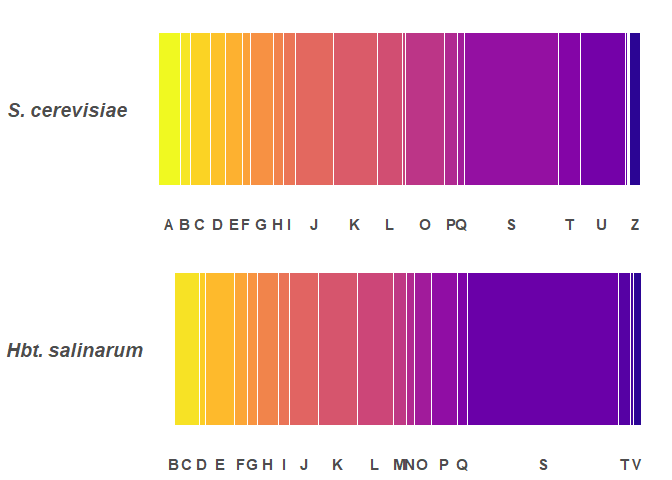
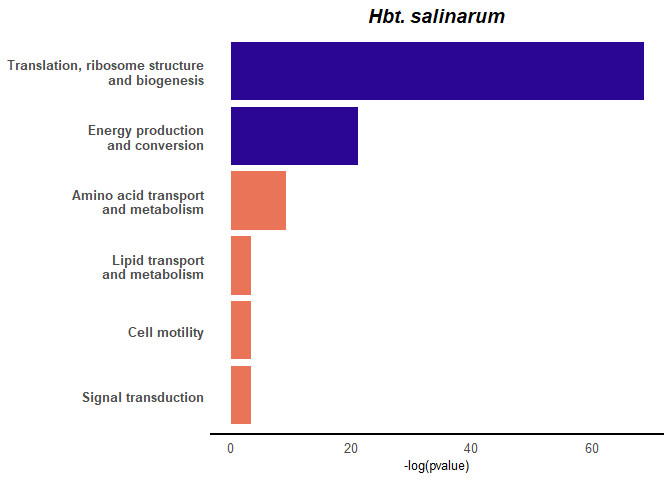
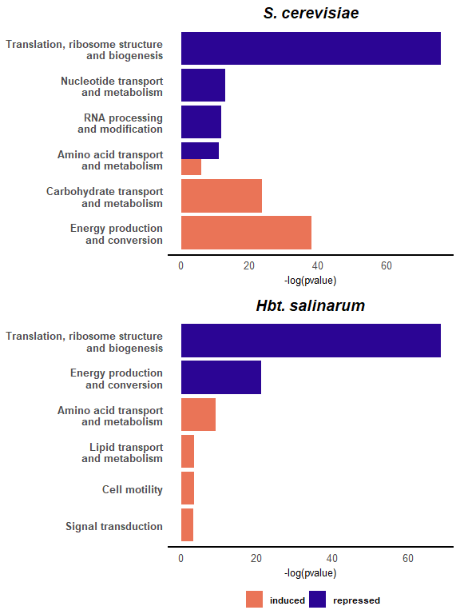

Figure 2: COG function enrichments
================

This notebook contains the analysis to generate figure 2 of the review. In order to perform functional enrichment, we need the distribution of functions in the whole genome. We generated this by using complete Ref Seq protein sequences for each organisms and mapping those sequences to orthologous groups (and functions) using eggnog mapper 4.5.

Set up
------

``` r
library(plyr);library(tidyverse); library(eulerr); library(forcats); library(viridis); library(cowplot)
source("00_custom_functions.R")
```

Load files:

``` r
#whole genomes nog files:
hbt.wg <- read_csv("../data/20181113_hbt_GCF_000006805.1_ASM680v1_eggnog.csv")
sc.wg <- read_csv("../data/20181113_scer_GCF_000146045.2_R64_eggnog.csv")
colnames(hbt.wg)[1] <- "acc"
colnames(sc.wg)[1] <- "acc"

#key files to convert from Wp/Np (protein acc) to locus names:
hbt.key <- read_csv("../data/20181113_hbt_GCF_000006805.1_ASM680v1_locusnames.csv")
hbt.key <- hbt.key[!is.na(hbt.key$old_locus_tag),]
sc.key <- read_csv("../data/20181113_scer_GCF_000146045.2_R64_locusnames.csv")

#cog descriptions:
cog.cats <- read_csv("../data/COG-descriptions.csv")

#whole genomes clusters:
scer.clust <- read_csv("../output/clustered_genelists/yeast2clusters.csv")
colnames(scer.clust)[1] <- "locus_tag"
hbt.clust <- read_csv("../output/clustered_genelists/hbt2clusters.csv")
colnames(hbt.clust)[1] <- "old_locus_tag"

#ESR clusters for comparison:
ESR.clust <- read_csv("../output/clustered_genelists/esrclusters.csv")

#manually curated NOG files
#Some genes weren't in the eggnog file. I manually searched eggNOG mapper and curated the NOG functional classification for those missing genes. 
sc.man <- read_csv("../output/clustered_genelists/sc_clust_missing_COG_curated.csv")
hbt.man <- read_csv("../output/clustered_genelists/hbt_clust_missing_COG_curated.csv")
left_join(hbt.key[c(1,3,8)], hbt.wg, by = "acc") -> hbt.wg
```

#### Manually correct some annotations:

If both the eggNOG mapper and single letter functional code are unassigned, assign to "S" or unknown function.

``` r
hbt.wg$COG_category[which(!is.na(hbt.wg$NOGs) & is.na(hbt.wg$COG_category))] <- "S"
```

If no orthologous group could be assigned, and the protein is annotated as hypothetical, manually assign functional category "S", and text description "Function unknown".

Some annotations were assigned a single letter functional COG code through eggNOG, but the text description did not reflect that.

Finally, annotations were cross-check with the Hbt. salinarum NRC1 reference genome hosted by the Baliga Lab. Any proteins with assigned function were undated accordingly.

``` r
hbt.wg$COG_category[which(hbt.wg$old_locus_tag == "VNG6287H")] <- "K"
  hbt.wg$HMM_description[which(hbt.wg$old_locus_tag == "VNG6287H")] <- "Transcriptional regulator, arsr family"

hbt.wg$COG_category[which(hbt.wg$old_locus_tag == "VNG6142C")] <- "L"
  hbt.wg$HMM_description[which(hbt.wg$old_locus_tag == "VNG6142C")] <- "conserved halobacteria DNA primase"

hbt.wg$COG_category[which(hbt.wg$annotation== "ISNCY family transposase ISH7A")] <- "L"
  hbt.wg$HMM_description[which(hbt.wg$annotation == "ISNCY family transposase ISH7A")] <- "transposase"
```

### Subset genome dataframes by cluster

Add locus tag columns to getNOG files and subset NOG files according to genes in cluster files:

``` r
sc.wg <- left_join(sc.wg, sc.key[1:2], by = "acc")
sc <- right_join(sc.wg, scer.clust, by = "locus_tag")
hbt <- right_join(hbt.wg, hbt.clust, by = "old_locus_tag")
```

Merge with the manually curated cog cats:

``` r
hbt.cog <-  left_join(hbt, hbt.man, by = c("COG_category", "HMM_description", "old_locus_tag", "cluster"))
sc.cog <- left_join(sc, sc.man, by = c("COG_category", "HMM_description", "locus_tag", "cluster"))
```

fill in all missing functional cats

Check that all loci in the clusters are represented in the final dfs:

    ## [1] 1000
    ## [1] 1000

create distribution of COGs in each genome
------------------------------------------

Conduct on the domain annotation level.

``` r
full_join(plyr::count(sc.wg$COG_category) %>%
    all.domains(., missingasS = T) %>%
    freq.as.percent(., "sc.percent"), 
  plyr::count(hbt.wg$COG_category) %>%
    all.domains(., missingasS = T) %>%
    freq.as.percent(., "hbt.percent"), by = "cogs") -> NOG.domain.freq
left_join(NOG.domain.freq, cog.cats, by = "cogs") -> NOG.domain.freq
```

Check that we have complete coverage of the genome:

    ##  sc.percent hbt.percent 
    ##         100         100

#### functional annotation across each species' genome:



#### whole genome functional annotation, stacked bar graph:


##### The Hbt. salinarum genome is dominated by proteins of unknown function.

"S" accounts for 19.5% of domains in S. cer and 32.3% of domains in Hbt. sal

Test for Functional Enrichment:
-------------------------------

Test for enrichment of the different clusters, using the hyper geometric test.

Compare S. cer clusters from this analysis with previously reported ESR genes:


Functional enrichment in Halobacterium clusters:

 We see some similarities in the functions of repressed genes.

complie figure and export
=========================

``` r
plot_grid(sc.cogs, hbt.cogs, plot_grid(NULL, legends, nrow = 1, rel_widths = c(0.5,1)), 
          ncol = 1, rel_heights = c(1,1,0.1)) -> sig.COGs
plot(sig.COGs)
```



Write out results files:

``` r
NOG.domain.freq[is.na(NOG.domain.freq)] <- 0
t.test(NOG.domain.freq$sc.percent, NOG.domain.freq$hbt.percent, paired = TRUE, alternative = "two.sided")

write_csv(NOG.domain.freq, "../output/whole_genome_COG.csv")
write_csv(sc.cog, "../output/sc_1000_genes.csv")
write_csv(hbt.cog, "../output/hb_1000_genes.csv")
write_csv(sc.cog.results, "../output/sc_COG_results.csv")
write_csv(hbt.cog.results, "../output/hb_COG_results.csv")
```

    ## 
    ##  Paired t-test
    ## 
    ## data:  NOG.domain.freq$sc.percent and NOG.domain.freq$hbt.percent
    ## t = -1.1546e-16, df = 23, p-value = 1
    ## alternative hypothesis: true difference in means is not equal to 0
    ## 95 percent confidence interval:
    ##  -1.657326  1.657326
    ## sample estimates:
    ## mean of the differences 
    ##           -9.250503e-17
