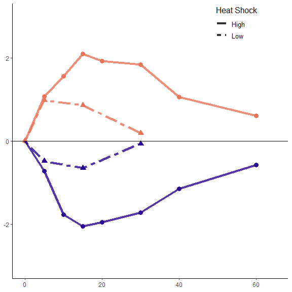
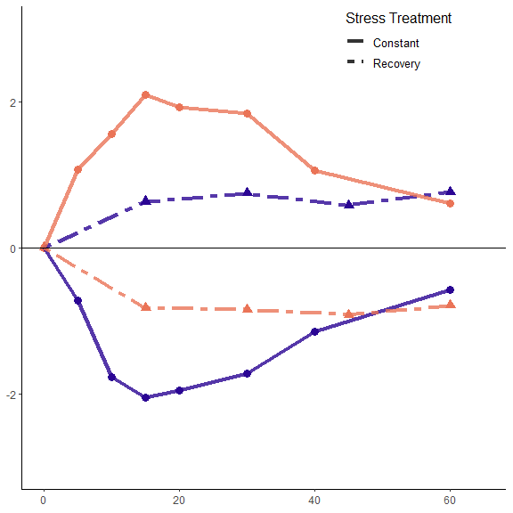
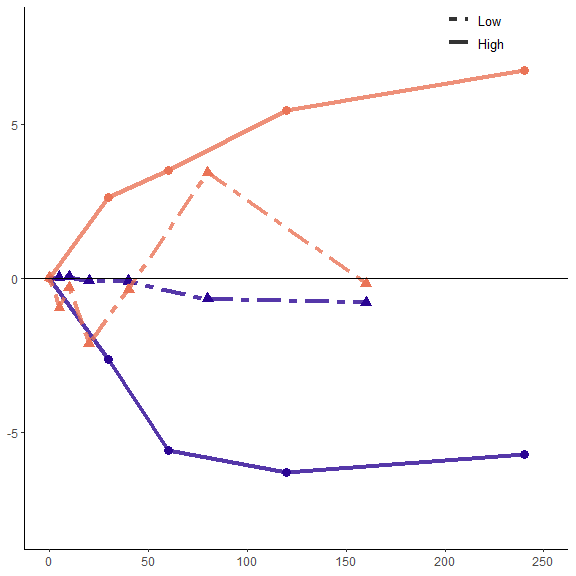
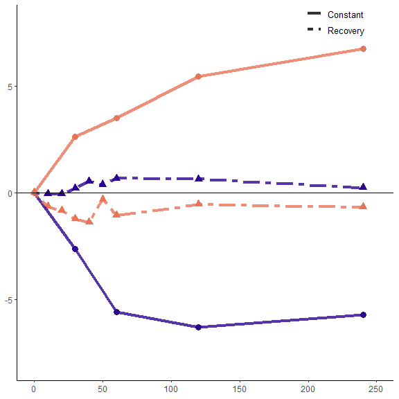
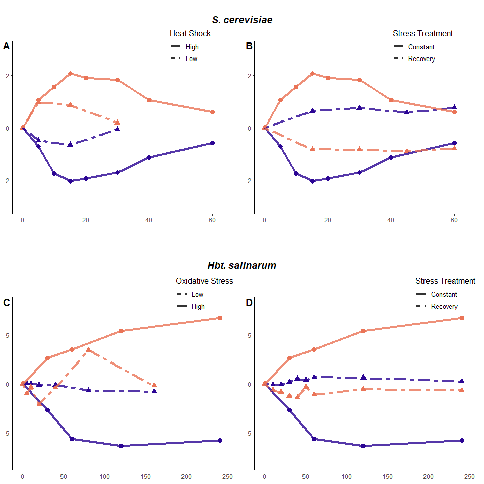
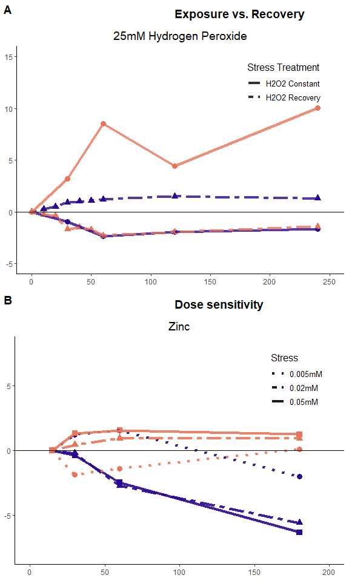

Figure 3: Comparing dynamic responses
================

This notebook contains the analysis to generate figure 3 of the review. In order to compare Hbt.sal and S. cer dynamics, we normalized each time series to the time 0, unshocked sample. This was similar to the normalization scheme conducted by Gasch et al. (2000). Supplemental figure 2 was also generated, showing that the Hbt. dynamics are not specific to a single condition.

Set up:
-------

``` r
#libraries
library(tidyverse); library(viridis); library(cowplot); library(grid); library(gridExtra)

#EXPRESSION DATA
scer <- read_csv("../output/cleaned_data/gasch_total.csv")
  scer[scer == 0] <- NA
  scer[scer == "#VALUE!"] <- NA
  scer <- scer[colSums(!is.na(scer)) > 0]
  scer[-1] <- lapply(scer[-1], function(x) as.numeric(as.character(x)))
sc.clust <- read_csv("../output/clustered_genelists/yeast2clusters.csv")
sc.clust$gene <-  str_replace_all(sc.clust$gene, "\\.", "-")

hbt <- read_csv("../output/cleaned_data/hbt_1000_var.csv")
hbt.clust <- read_csv("../output/clustered_genelists/hbt2clusters.csv")

#functions
source("00_custom_functions.R")
```

YEAST
-----

Use cluster information to filter expression data. Calculate the mean of all gene expression across conditions (as in analysis for figure 1):

``` r
sc.esr <- scer[scer$gene %in% sc.clust$gene,]

t.yeast00 <- data.t(sc.esr, sc.esr$gene, scaled = "NULL")
  colnames(t.yeast00) <-  colnames(t.yeast00) %>% str_replace_all(., "\\.", "-")
yeast00.long <- gather(t.yeast00, gene, expression, -cond)
yeast00.long[yeast00.long == 0] <- NA

ex.yeast <- left_join(yeast00.long, sc.clust, by = "gene")
ex.yeast[is.na(ex.yeast)] <- 0

#get mean expression by conditon for clusters and overall
#detach(package:plyr)
ex.yeast %>%
  group_by(cluster, cond) %>%
  summarise(rep = length(expression), avg_expression = mean(expression),
            CI95 = conf_int95(expression)) -> y.avg.ex
```

#### Severe versus mild stress

Dynamics of the two clusters when exposed to high levels of heat shock (25C to 37C shift) versus moderate heat shock (29C to 33C).

``` r
y.avg.ex[str_detect(y.avg.ex$cond, "Heat.*hs-1"),] %>%
  separate(cond, c("cond", "time"), "Shock ")  ->a
a$time <- as.integer(str_replace_all(a$time, ".in.*", ""))
a$cluster <- as.character(a$cluster)
a$cond <- rep("25C to 37C", length(a$cond))

y.avg.ex[str_detect(y.avg.ex$cond, "29C to"),] %>%
  separate(cond, c("cond", "time"), " - ")  ->b
b$time <- as.integer(str_replace_all(b$time, ".in.*", ""))
b$cluster <- as.character(b$cluster)

zeros <- data.frame("cluster" = c("1","2","1","2"),
                    "cond" = c("29C to 33C", "29C to 33C", "25C to 37C", "25C to 37C"),
                    "time" = c(0,0,0,0),
                    "rep" = rep(NA, 4),
                    "avg_expression" = rep(0, 4),
                    "CI95" = rep(NA, 4), stringsAsFactors = F)

#add a zero time point (lost when we normalized)
a <- bind_rows(a, zeros)

rbind(a,b) %>%
  ggplot(aes(x=time, y=avg_expression, shape = cond, color = cluster, group= interaction(cond, cluster)))+
  geom_point(show.legend = F, size = 3, fill = NA)+
  geom_line(aes(linetype = cond), size = 1.5, alpha = 0.8) +
  scale_color_viridis(option = "C", begin = 0.05, end = 0.65, discrete = T, guide = F) +
  scale_linetype_manual(labels = c("High", "Low"), values = c("25C to 37C" = 1, "29C to 33C" = 6)) +
  geom_hline(yintercept =0, color = "black") +
  xlim(0, 65)+ylim(-3,3)+
  labs(y = "Expression fold-change relative to unstressed baseline", x= "Time (minutes)", linetype = "Heat Shock") +
  theme_classic() + theme(axis.title.x=element_blank(), 
                          axis.title.y=element_blank(),
                          legend.title = element_text(family = "sans", size = 12),
                          legend.text = element_text(size = 10),
                          legend.justification=c(1,0), 
                          legend.position=c(.9, 0.85),  
                          legend.background = element_blank(),
                          legend.key = element_blank()) -> panel.A
panel.A
```



``` r
rbind(a,b) %>%
  ggplot(aes(x=time, y=avg_expression, shape = cond, color = cluster, group= interaction(cond, cluster)))+
  #geom_point(show.legend = F, size = 3, fill = NA)+
  #geom_line(aes(linetype = cond), size = 1.5, alpha = 0.8) +
  stat_smooth(aes(x=time, y=avg_expression, linetype = cond), method = lm, formula = y ~ poly(x, 3), se = FALSE, size =2) +
  scale_color_viridis(option = "C", begin = 0.05, end = 0.65, discrete = T, guide = F) +
  scale_linetype_manual(labels = c("High", "Low"), values = c("25C to 37C" = 1, "29C to 33C" = 3)) +
  geom_hline(yintercept =0, color = "black", size = 1) +
  xlim(0, 60)+ylim(-2.2,2.2)+
  labs(y = "Expression relative to unstressed baseline", x= "Time", linetype = "Stress Level") +
  theme_classic() + theme(axis.line = element_line(colour = "black", size = 1, linetype = "solid"),
                          axis.ticks = element_blank(), axis.text.x = element_blank(), axis.text.y = element_blank(),
                          axis.title = element_text(family = "sans", size = 16, face = "bold"),
                          legend.title = element_text(family = "sans", size = 14),
                          legend.text = element_text(size = 12, color = "black"),
                          legend.justification=c(1,0), 
                          legend.position=c(.9, 0.85),  
                          legend.background = element_blank(),
                          legend.key = element_blank()) -> graphical.abs
ggsave("../output/figures/graphical.png")
```

    ## Saving 6 x 6 in image

#### Exposure versus removal from stress

Repeat analysis on exposure (25 to 37C) versus removal (37 to 25C) of from heat shock 

HBT
---

Use cluster information to filter expression data. Calculate the mean of all gene expression across conditions (as in analysis for figure 1):

``` r
t.hbt <- data.t(hbt, hbt$gene, scaled = "gene")
hbt.long <- gather(t.hbt, gene, expression, -cond)
hbt.long[hbt.long == 0] <- NA

ex.hbt <- left_join(hbt.long, hbt.clust)
ex.hbt[is.na(ex.hbt)] <- 0

#get mean expression by conditon for clusters and overall
ex.hbt %>%
  group_by(cluster, cond) %>%
  summarise(rep = length(expression), avg_expression = mean(expression),
            Std.error = sd(expression)/sqrt(length(expression))) -> hbt.avg.ex
```

Filter expression data by treatments with high and low paraquat:

``` r
hbt.avg.ex[str_detect(hbt.avg.ex$cond, "PQ_Con.*0.25"),] %>%
  separate(cond, c("condition", "time"), "mM_") -> c
c$time <- as.integer(str_replace_all(c$time, "m.*", ""))
c$cluster <- as.character(c$cluster)

hbt.avg.ex[str_detect(hbt.avg.ex$cond, "PQ_Con.*1_4m"),] %>%
  separate(cond, c("condition", "time"), "mM_") -> d
d$time <- as.integer(str_replace_all(d$time, "min.*", ""))
#d$time <- as.integer(str_replace_all(c$time, "-.*", "0"))
d$cluster <- as.character(d$cluster)
```

#### Severe versus mild stress

Normalize the high and low paraquat treatments to the time zero samples:

``` r
df2 <- 
  filter(c, time == 0) %>% 
  select(c("cluster", "avg_expression")) %>%
  setNames(.,c("cluster", "a"))

full_join(c,df2,by="cluster") %>%
   group_by(cluster) %>%
   mutate(avg_expression=avg_expression/abs(a)) %>%
   select(-a) -> c

df2 <- 
  filter(d, time == 0) %>% 
  select(c("cluster", "avg_expression")) %>%
  setNames(.,c("cluster", "a"))
 
full_join(d,df2,by="cluster") %>%
   group_by(cluster) %>%
   mutate(avg_expression=avg_expression/abs(a)) %>%
   select(-a) -> d

#zero transform (because a/a = 1, and we would like it to equal 0)
c %>% filter(cluster==1) %>%
  group_by(cluster, condition, time) %>%
  summarise(avg_exp = avg_expression -1) -> c.1
c %>% filter(cluster==2) %>%
  group_by(cluster, condition, time) %>%
  summarise(avg_exp = avg_expression +1) -> c.2
rbind(c.1, c.2) ->c

d %>% filter(cluster==1) %>%
  group_by(cluster, condition, time) %>%
  summarise(avg_exp = avg_expression -1) -> d.1
d %>% filter(cluster==2) %>%
  group_by(cluster, condition, time) %>%
  summarise(avg_exp = avg_expression +1) -> d.2
rbind(d.1, d.2) ->d

rbind(d,c) %>%
  ggplot(aes(x=time, y=avg_exp, shape = condition, color = cluster, group= interaction(condition, cluster)))+
  geom_point(show.legend = F, size = 3, fill = NA)+
  scale_shape_manual(values = c(17, 19))+
  geom_line(aes(linetype = condition), size = 1.5, alpha = 0.8) +
  scale_color_viridis(option = "C", begin = 0.05, end = 0.65, discrete = T, guide = F) + 
  scale_linetype_manual(labels = c("Low", "High"), 
                        values = c("PQ_Const._set_1_4" = 1, "PQ_Const._set_1_0.25" = 6)) +
  geom_hline(yintercept =0, color = "black") +
  xlim(c(0,250))+ylim(c(-8,8))+
  labs(y = "Expression fold-change relative to unstressed baseline", 
       x ="Time (minutes)", 
       linetype = "Oxidative Stress") +
  theme_classic() + theme(axis.title.x=element_blank(), 
                          axis.title.y=element_blank(),
                          legend.title = element_text(family = "sans", size = 12),
                          legend.text = element_text(size = 10),
                          legend.justification=c(1,0), 
                          legend.position=c(1, 0.90),  
                          legend.background = element_blank(),
                          legend.key = element_blank())-> panel.C
panel.C
```



#### Exposure versus removal from stress

Repeat, but for samples under constant treatment of paraquat, or recovery from paraquat treatment


Bring all the panels together:
------------------------------

``` r
plot_grid(panel.A, panel.B,
          labels = c("A", "B")) -> plots
title1 <- ggdraw() + 
  draw_label("S. cerevisiae", fontfamily = "sans", size = 14,
             fontface = 'bold.italic')

plot_grid(panel.C, panel.D,
          labels = c("C", "D")) -> plots2
title2 <- ggdraw() + 
  draw_label("Hbt. salinarum", fontfamily = "sans", size = 14,
             fontface = 'bold.italic', vjust = 1)

plot_grid(title1, plots, title2, plots2,ncol = 1, rel_heights = c(0.2, 1, 0.35, 1)) -> plots

y.grob <- textGrob("Expression fold-change relative to unstressed baseline", 
                   gp=gpar(fontface="bold", col="black", fontsize=12), rot=90)
x.grob <- textGrob("time (minutes)", 
                   gp=gpar(fontface="bold", col="black", fontsize=12))
plot(plots)
```



### export figure

``` r
#save plot
tiff("../output/figures/Figure3.tif", units="in", width=5, height=5, res=300)
grid.arrange(arrangeGrob(plots, left = y.grob, bottom = x.grob))
dev.off()

pdf("../output/figures/Figure3.pdf", width = 10, height = 10)
grid.arrange(arrangeGrob(plots, left = y.grob, bottom = x.grob))
dev.off()
```

Same dynamics are present in other conditions (supplemental fig2)
-----------------------------------------------------------------

H2o2 recovery vs. constant:

copper doses:

zinc doses:

Temp+circadian:

Outliers: UV:

EMS (UV + DNA damage)

Combine:

``` r
title1 <-  ggdraw()+
  draw_label("Exposure vs. Recovery",  fontfamily = "sans", size = 14, fontface = 'bold', hjust = 0)
title2 <-  ggdraw()+
  draw_label("Dose sensitivity",  fontfamily = "sans", size = 14, fontface = 'bold', hjust = 0)
title3 <-  ggdraw()+
  draw_label("DNA and UV damage may elicite a distinct response",  fontfamily = "sans", size = 14, fontface = 'bold', hjust = 0)

plot_grid(title1, h2o2, title2, zinc,
  #plot_grid(title3, NULL, nrow = 1), plot_grid(UV.rad, EMS, NULL, nrow = 1),
  ncol = 1, rel_heights = c(0.1, 1, 0.1, 1), labels = c("A", NA, "B", NA)) -> Supp2
Supp2
```



export:

``` r
pdf("../output/figures/SuppFig2.pdf", width = 6, height = 10)
grid.arrange(arrangeGrob(Supp2, left = y.grob, bottom = x.grob))
#plot(Supp2)
dev.off()
```

    ## png 
    ##   2

``` r
#save plot
```
