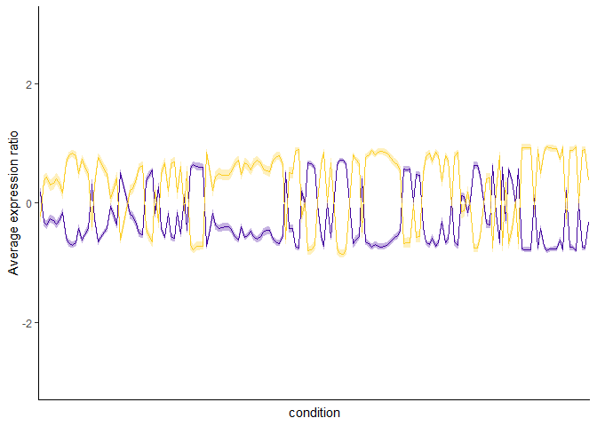
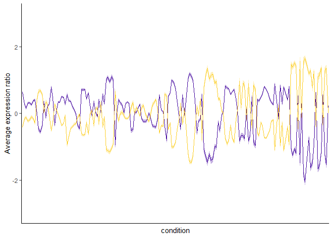
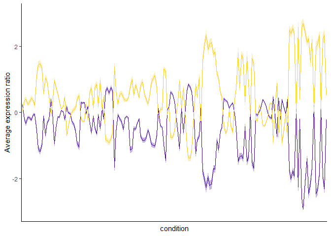
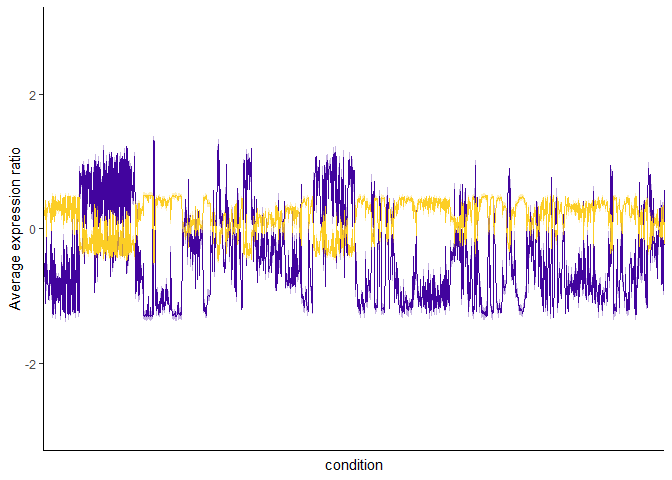
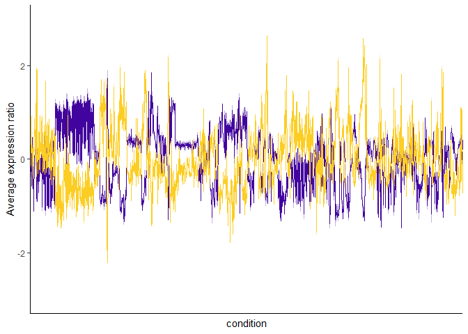
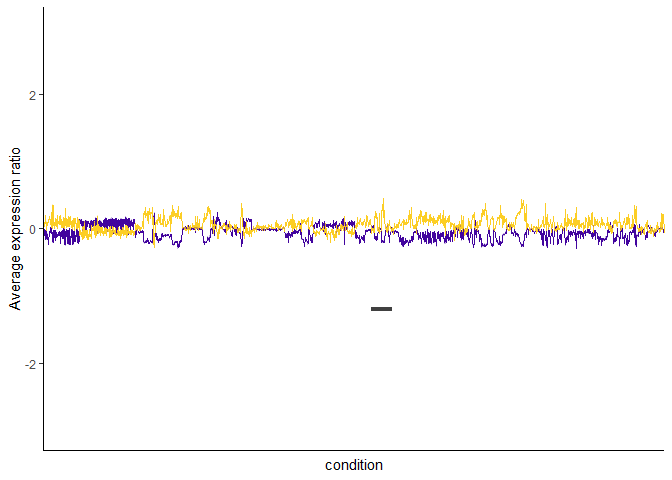
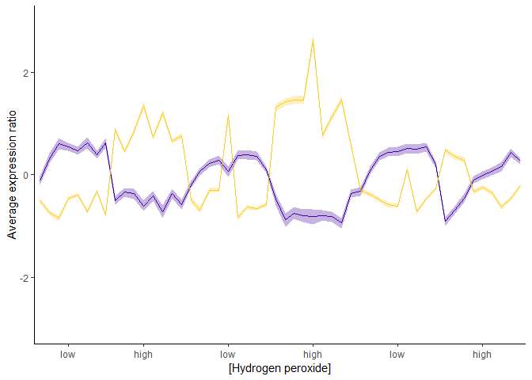
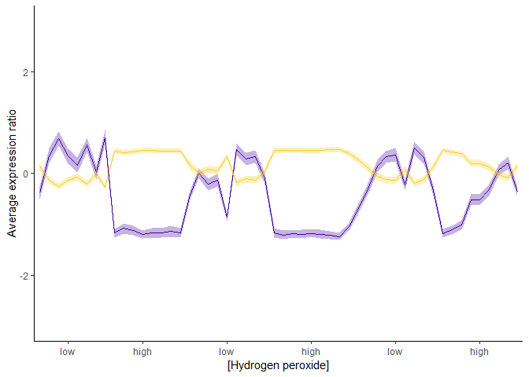
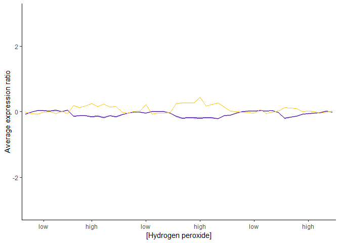

Scaling exploration
================

This notebook compares scaling the expression data different ways. Prompted because I noticed that the expression ranges for s. cer data were larger than hbt and curious if there was a better solution than adjusting axes margins in the main figures.. mostly because I'm fairly sure its an artifact of how each data set was normalized, but I don't want to investigate that for the purpose of the review.

Which brings me to three (easy) options: 1. scale() by gene expression... interpretation: single gene expression across all conditions is 0 centered and standardized. Equivalent to scaling across conditions
2. scale() within conditions... interpretation: all gene expression within a condition is 0 centered and standardized.
3. don't scale, just adjust axes.

Elected to use scale across genes rather than within conditions because it maintains the noise/spikiness, but evens the amplitude of gene expression between the two species.

Load libraries/files/functions:

``` r
library(tidyverse); library(dplyr); library(dendextend)
library(viridis); library(gplots); library(scales)

#load files:
yeast00 <- read_csv("../output/cleaned_data/gasch_1000_var.csv")
hbt07 <- read_csv("../output/cleaned_data/hbt_1000_var.csv")
y.clust <- read_csv("../output/clustered_genelists/yeast2clusters.csv")
h.clust <- read_csv("../output/clustered_genelists/hbt2clusters.csv")

#functions
data.t <- function(df, genelist, scaled = c("cond", "gene")) {
  num.df <- select_if(df, is.numeric)
  if (scaled == "cond") {num.df <-  scale(num.df)}
  condlist <- as.vector(colnames(num.df))
  if (nrow(num.df) == length(genelist)) {
    tmp <- as.data.frame(t(num.df), stringsAsFactors = F)
    if (scaled == "gene") {tmp <-  scale(tmp)}
    colnames(tmp) <- genelist
    rownames(tmp) <- NULL
    wide <- data.frame("cond" = condlist, tmp, stringsAsFactors = F)
    rownames(wide) <- NULL
    return(wide) 
    }
  else  {
    return("genelist wrong length")
    }
}

conf_int95 <- function(data) {
  n <- length(data)
  error <- qt(0.975, df = n - 1) * sd(data) / sqrt(n)
  return(error)
}
```

Scer plots:

``` r
t.yeast00 <- data.t(yeast00, yeast00$gene, scaled = F)
  colnames(t.yeast00) <-  colnames(t.yeast00) %>% str_replace_all(., "\\.", "-")
sccond <- data.t(yeast00, yeast00$gene, scaled = "cond")
scgene <- data.t(yeast00, yeast00$gene, scaled = "gene")

#get in long format
yeast.long <- gather(t.yeast00, gene, expression, -cond)
yeast.long[yeast.long == 0] <- NA
scc.long <- gather(sccond, gene, expression, -cond)
scc.long[scc.long == 0] <- NA
scg.long <- gather(scgene, gene, expression, -cond)
scg.long[scg.long == 0] <- NA

#get avg expressions
ex.yeast <- left_join(yeast.long, y.clust)
ex.yeast[is.na(ex.yeast)] <- 0
ex.scc <- left_join(scc.long, y.clust)
ex.scc[is.na(ex.scc)] <- 0
ex.scg <- left_join(scg.long, y.clust)
ex.scg[is.na(ex.scg)] <- 0

#get mean expression by conditon for clusters and overall
ex.scc %>%
  group_by(cluster, cond) %>%
  summarise(rep = length(expression), avg_expression = mean(expression),
            CI95 = conf_int95(expression)) %>%
  filter(cluster != 0) %>%
ggplot(aes(x = cond, y = avg_expression, group = cluster, color = cluster)) +
  geom_line(show.legend = F) +
  geom_ribbon(aes(
      ymin = avg_expression - CI95,
      ymax = avg_expression + CI95,
      fill = cluster), color = NA, alpha = 0.3) +
  scale_color_viridis(option = "C", begin = 0.1, end = 0.9) + 
  scale_fill_viridis(option = "C", begin = 0.1, end = 0.9) +
  ylim(-3,3) + xlab('condition') + ylab('Average expression ratio') + theme_classic() +
  theme(axis.text.x = element_blank(), axis.ticks.x = element_blank())
```



``` r

ex.scg %>%
  group_by(cluster, cond) %>%
  summarise(rep = length(expression), avg_expression = mean(expression),
            CI95 = conf_int95(expression)) %>%
  filter(cluster != 0) %>%
  ggplot(aes(x = cond, y = avg_expression, group = cluster, color = cluster)) +
  geom_line(show.legend = F) +
  geom_ribbon(aes(
      ymin = avg_expression - CI95,
      ymax = avg_expression + CI95,
      fill = cluster), color = NA, alpha = 0.3) +
  scale_color_viridis(option = "C", begin = 0.1, end = 0.9) + 
  scale_fill_viridis(option = "C", begin = 0.1, end = 0.9) +
  ylim(-3,3) + xlab('condition') + ylab('Average expression ratio') + theme_classic() +
  theme(axis.text.x = element_blank(), axis.ticks.x = element_blank())
```



``` r

ex.yeast %>%
  group_by(cluster, cond) %>%
  summarise(rep = length(expression), avg_expression = mean(expression),
            CI95 = conf_int95(expression)) %>% 
  ggplot(aes(x = cond, y = avg_expression, group = cluster, color = cluster)) +
  geom_line(show.legend = F) +
  geom_ribbon(aes(
      ymin = avg_expression - CI95,
      ymax = avg_expression + CI95,
      fill = cluster), color = NA, alpha = 0.3) +
  scale_color_viridis(option = "C", begin = 0.1, end = 0.9) + 
  scale_fill_viridis(option = "C", begin = 0.1, end = 0.9) +
  ylim(-3,3) + xlab('condition') + ylab('Average expression ratio') + theme_classic() +
  theme(axis.text.x = element_blank(), axis.ticks.x = element_blank())
```



Hbt:

``` r
t.hbt07 <- data.t(hbt07, hbt07$gene, scaled = F)
hccond <- data.t(hbt07, hbt07$gene, scaled = "cond")
hcgene <- data.t(hbt07, hbt07$gene, scaled = "gene")

#get in long format
hbt.long <- gather(t.hbt07, gene, expression, -cond)
hbt.long[hbt.long == 0] <- NA
hcc.long <- gather(hccond, gene, expression, -cond)
hcc.long[hcc.long == 0] <- NA
hcg.long <- gather(hcgene, gene, expression, -cond)
hcg.long[hcg.long == 0] <- NA

#get avg expressions
ex.hbt <- left_join(hbt.long, h.clust)
ex.hbt[is.na(ex.hbt)] <- 0
ex.hcc <- left_join(hcc.long, h.clust)
ex.hcc[is.na(ex.hcc)] <- 0
ex.hcg <- left_join(hcg.long, h.clust)
ex.hcg[is.na(ex.hcg)] <- 0

#get mean expression by conditon for clusters and overall
ex.hcc %>%
  group_by(cluster, cond) %>%
  summarise(rep = length(expression), avg_expression = mean(expression),
            CI95 = conf_int95(expression)) %>%
ggplot(aes(x = cond, y = avg_expression, group = cluster, color = cluster)) +
  geom_line(show.legend = F) +
  geom_ribbon(aes(ymin = avg_expression - CI95,ymax = avg_expression + CI95,fill = cluster), 
              color = NA, alpha = 0.3) +
  scale_color_viridis(option = "C", begin = 0.1, end = 0.9) + 
  scale_fill_viridis(option = "C", begin = 0.1, end = 0.9) +
  ylim(-3,3) + xlab('condition') + ylab('Average expression ratio') + theme_classic() +
  theme(axis.text.x = element_blank(), axis.ticks.x = element_blank())
```



``` r

ex.hcg %>%
  group_by(cluster, cond) %>%
  summarise(rep = length(expression), avg_expression = mean(expression),
            CI95 = conf_int95(expression)) %>%
ggplot(aes(x = cond, y = avg_expression, group = cluster, color = cluster)) +
  geom_line(show.legend = F) +
  geom_ribbon(aes(ymin = avg_expression - CI95,ymax = avg_expression + CI95,fill = cluster), 
              color = NA, alpha = 0.3) +
  scale_color_viridis(option = "C", begin = 0.1, end = 0.9) + 
  scale_fill_viridis(option = "C", begin = 0.1, end = 0.9) +
  ylim(-3,3) + xlab('condition') + ylab('Average expression ratio') + theme_classic() +
  theme(axis.text.x = element_blank(), axis.ticks.x = element_blank())
```



``` r

ex.hbt %>%
  group_by(cluster, cond) %>%
  summarise(rep = length(expression), avg_expression = mean(expression),
            CI95 = conf_int95(expression)) %>%
  ggplot(aes(x = cond, y = avg_expression, group = cluster, color = cluster)) +
  geom_line(show.legend = F) +
  geom_ribbon(aes(
      ymin = avg_expression - CI95,
      ymax = avg_expression + CI95, fill = cluster), color = NA, alpha = 0.3) +
  geom_segment(aes(x = 789, xend = 840, y=-1.2, yend =-1.2), color = "grey25", size = 1.5) + 
  #got window using the sort() and which() functions
  ylim(-3, 3) + #scale_x_discrete(limits = hbt.cond)+
  scale_color_viridis(option = "C", begin = 0.1, end = 0.9) + 
  scale_fill_viridis(option = "C", begin = 0.1, end = 0.9) +
  xlab('condition') + ylab('Average expression ratio') + theme_classic() +
  theme(axis.text.x = element_blank(), axis.ticks.x = element_blank())
```



close up of hbt:

``` r
ex.hbt[ex.hbt$cond %in% str_subset(ex.hbt$cond, "H2O2.*Rec"),]$cond -> h2o2
condition <- "H2O2.*Rec"

ex.hcg[ex.hcg$cond %in% str_subset(ex.hcg$cond, condition),] %>%
  group_by(cluster, cond) %>%
  summarise(rep = length(expression), avg_expression = mean(expression),
            CI95 = conf_int95(expression)) %>%
  ggplot(aes(x = cond, y = avg_expression, group = cluster, color = cluster)) +
    geom_line(show.legend = F) +
    geom_ribbon(aes(
        ymin = avg_expression - CI95,
        ymax = avg_expression + CI95,
        fill = cluster), color = NA, alpha = 0.3) +
    scale_color_viridis(option = "C", begin = 0.1, end = 0.9) + 
    scale_fill_viridis(option = "C", begin = 0.1, end = 0.9) +
    ylim(-3,3) + xlab("[Hydrogen peroxide]") + ylab('Average expression ratio') +
  scale_x_discrete(breaks = c("H2O2_Recov._set_1_0mM_030min_vs_NRC-1d.sig", "H2O2_Recov._set_1_50mM_030min_vs_NRC-1d.sig", 
                              "H2O2_Recov._set_2_0mM_040min_vs_NRC-1f.sig", "H2O2_Recov._set_2_25mM_040min_vs_NRC-1f.sig", 
                              "H2O2_Recov._set_3_0mM_040min_vs_NRC-1f.sig", "H2O2_Recov._set_3_25mM_040min_vs_NRC-1f.sig"), 
                   labels = c("low", "high", "low", "high", "low", "high")) + theme_classic() 
```



``` r

ex.hcc[ex.hcc$cond %in% str_subset(ex.hcc$cond, condition),] %>%
  group_by(cluster, cond) %>%
  summarise(rep = length(expression), avg_expression = mean(expression),
            CI95 = conf_int95(expression)) %>%
  ggplot(aes(x = cond, y = avg_expression, group = cluster, color = cluster)) +
    geom_line(show.legend = F) +
    geom_ribbon(aes(
        ymin = avg_expression - CI95,
        ymax = avg_expression + CI95,
        fill = cluster), color = NA, alpha = 0.3) +
    scale_color_viridis(option = "C", begin = 0.1, end = 0.9) + 
    scale_fill_viridis(option = "C", begin = 0.1, end = 0.9) +
    ylim(-3,3) + xlab("[Hydrogen peroxide]") + ylab('Average expression ratio') +
  scale_x_discrete(breaks = c("H2O2_Recov._set_1_0mM_030min_vs_NRC-1d.sig", "H2O2_Recov._set_1_50mM_030min_vs_NRC-1d.sig", 
                              "H2O2_Recov._set_2_0mM_040min_vs_NRC-1f.sig", "H2O2_Recov._set_2_25mM_040min_vs_NRC-1f.sig", 
                              "H2O2_Recov._set_3_0mM_040min_vs_NRC-1f.sig", "H2O2_Recov._set_3_25mM_040min_vs_NRC-1f.sig"), 
                   labels = c("low", "high", "low", "high", "low", "high")) + theme_classic()
```



``` r

ex.hbt[ex.hbt$cond %in% str_subset(ex.hbt$cond, condition),] %>%
  group_by(cluster, cond) %>%
  summarise(rep = length(expression), avg_expression = mean(expression),
            CI95 = conf_int95(expression)) %>%
  ggplot(aes(x = cond, y = avg_expression, group = cluster, color = cluster)) +
    geom_line(show.legend = F) +
    geom_ribbon(aes(
        ymin = avg_expression - CI95,
        ymax = avg_expression + CI95,
        fill = cluster), color = NA, alpha = 0.3) +
    scale_color_viridis(option = "C", begin = 0.1, end = 0.9) + 
    scale_fill_viridis(option = "C", begin = 0.1, end = 0.9) +
    ylim(-3,3) + xlab("[Hydrogen peroxide]") + ylab('Average expression ratio') +
  scale_x_discrete(breaks = c("H2O2_Recov._set_1_0mM_030min_vs_NRC-1d.sig", "H2O2_Recov._set_1_50mM_030min_vs_NRC-1d.sig", 
                              "H2O2_Recov._set_2_0mM_040min_vs_NRC-1f.sig", "H2O2_Recov._set_2_25mM_040min_vs_NRC-1f.sig", 
                              "H2O2_Recov._set_3_0mM_040min_vs_NRC-1f.sig", "H2O2_Recov._set_3_25mM_040min_vs_NRC-1f.sig"), 
                   labels = c("low", "high", "low", "high", "low", "high")) + theme_classic() 
```


