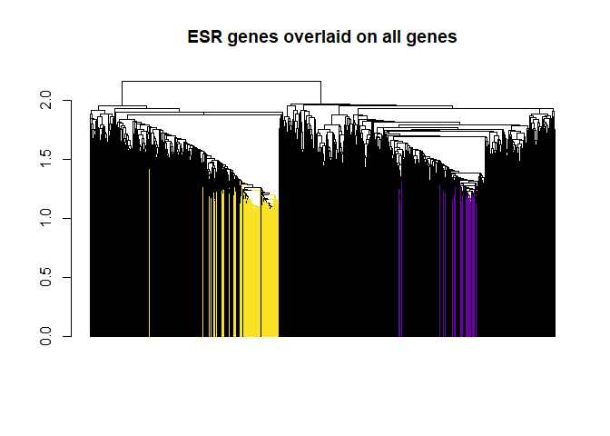
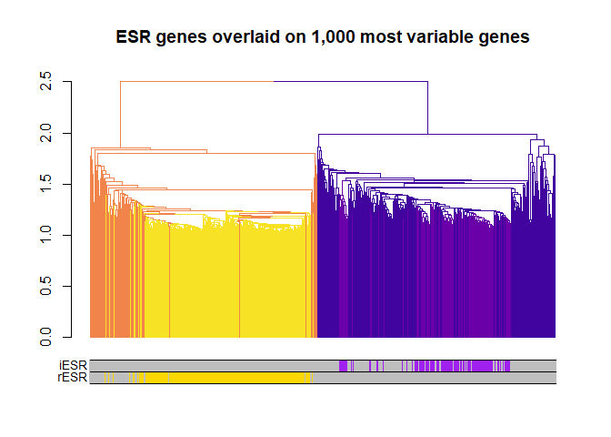

Supplemental\_Figure\_1
================

``` r
library(tidyverse); library(dplyr); library(dendextend)
library(viridis); library(gplots); library(scales)

source("00_custom_functions.R")

#load files:
yeast1000 <- read_csv("../output/cleaned_data/gasch_1000_var.csv")
hbt1000 <- read_csv("../output/cleaned_data/hbt_1000_var.csv")

esr <- read_csv("../output/cleaned_data/gasch_esr.csv")
hbt <- read_csv("../output/cleaned_data/hbt_esr_percent.csv")

#whole genomes nog files:
hbt.wg <- read_csv("../data/20181113_hbt_GCF_000006805.1_ASM680v1_eggnog.csv")
sc.wg <- read_csv("../data/20181113_scer_GCF_000146045.2_R64_eggnog.csv")
colnames(hbt.wg)[1] <- "acc"
colnames(sc.wg)[1] <- "acc"

#whole genomes clusters:
clusters.yeast <- read_csv("../output/clustered_genelists/yeast2clusters.csv")
colnames(clusters.yeast)[1] <- "locus_tag"
hbt.clust <- read_csv("../output/clustered_genelists/hbt2clusters.csv")
colnames(hbt.clust)[1] <- "old_locus_tag"
```

check that there are no duplicate gene entries and that all ESR genes are accounted for.
========================================================================================

``` r
length(esr$gene)
```

    ## [1] 868

``` r
nrow(yeast1000[yeast1000$gene %in% esr$gene,]) + nrow(esr[esr$gene %ni% yeast1000$gene,])
```

    ## [1] 868

``` r
##check that there are no duplications
#esr$gene[duplicated(esr$gene)]
#yeast1000$gene[duplicated(yeast1000$gene)]
```

Create dendrograms and correlation matrices
-------------------------------------------

analysis of top 1000 genes using spearman correlation rather than pearson

``` r
set.seed(123)

t.yeast1000 <- data.t(yeast1000, yeast1000$gene, scaled = "gene")
colnames(t.yeast1000) <-  colnames(t.yeast1000) %>% str_replace_all(., "\\.", "-")
yeast1000.cor <- select(t.yeast1000, -cond) %>% cor(use = "pairwise.complete.obs", method = "spearman")
yeast1000.dist <- as.dist(1-yeast1000.cor)
yeast1000.dend <- as.dendrogram(hclust(yeast1000.dist, method = "average"))

t.hbt1000 <- data.t(hbt1000, hbt1000$gene, scaled = "gene")
hbt1000.cor <- select(t.hbt1000, -cond) %>% cor(use = "pairwise.complete.obs", method = "spearman")
hbt1000.dist <- as.dist(1-hbt1000.cor)
hbt1000.dend <- as.dendrogram(hclust(hbt1000.dist, method = "average"))

##heatmap of ESR only genes, and ~16% most variable.
t.esr <- data.t(esr, esr$gene, scaled = "gene")
colnames(t.esr) <-  colnames(t.esr) %>% str_replace_all(., "\\.", "-")
esr.cor <- select(t.esr, -cond) %>% cor(use = "pairwise.complete.obs", method = "spearman")
esr.dist <- as.dist(1-esr.cor)
esr.dend <- as.dendrogram(hclust(esr.dist, method = "average"))

t.hbt <- data.t(hbt, hbt$gene, scaled = "gene")
hbt.cor <- select(t.hbt, -cond) %>% cor(use = "pairwise.complete.obs", method = "spearman")
hbt.dist <- as.dist(1-hbt.cor)
hbt.dend <- as.dendrogram(hclust(hbt.dist, method = "average"))
```

Average expression of cluters (~16% and ESR)
============================================

``` r
clusters.esr <- cutree(esr.dend, k=2) %>% 
  data.frame(gene = names(.), cluster = ., row.names = NULL, stringsAsFactors = F)

clusters.hbt <- cutree(hbt.dend, k=2) %>% 
  data.frame(gene = names(.), cluster = ., row.names = NULL, stringsAsFactors = F)

esr.long <- gather(t.esr, gene, expression, -cond)
hbt.long <- gather(t.hbt, gene, expression, -cond)

#set 0 to NA
esr.long[esr.long == 0] <- NA
hbt.long[hbt.long == 0] <- NA

ex.esr <- full_join(clusters.esr, esr.long, by = "gene")
ex.esr[is.na(ex.esr)] <- 0
ex.hbt <- full_join(clusters.hbt, hbt.long, by = "gene")
ex.hbt[is.na(ex.hbt)] <- 0

#get mean expression by conditon for clusters and overall
ex.esr %>%
  group_by(cluster, cond) %>%
  summarise(rep = length(expression), avg_expression = mean(expression),
            CI95 = conf_int95(expression)) -> esr.avg.ex
ex.hbt %>%
  group_by(cluster, cond) %>%
  summarise(rep = length(expression), avg_expression = mean(expression),
            CI95 = conf_int95(expression)) -> hbt.avg.ex
```

Which cluster is induced or repressed?
--------------------------------------

``` r
#S. cer
clusters.esr %>%
  group_by(cluster) %>%
  tally()

clusters.yeast[clusters.yeast$locus_tag %in% filter(clusters.esr, cluster == 2)$gene,]
clusters.yeast[clusters.yeast$locus_tag %in% filter(clusters.esr, cluster == 1)$gene,]
```

    ## # A tibble: 2 x 2
    ##   cluster     n
    ##     <int> <int>
    ## 1       1   585
    ## 2       2   283
    ## # A tibble: 196 x 2
    ##    locus_tag cluster
    ##    <chr>       <dbl>
    ##  1 YAL061W         2
    ##  2 YBL049W         2
    ##  3 YBL064C         2
    ##  4 YBL075C         2
    ##  5 YBR006W         2
    ##  6 YBR052C         2
    ##  7 YBR053C         2
    ##  8 YBR056W         2
    ##  9 YBR072W         2
    ## 10 YBR126C         2
    ## # ... with 186 more rows
    ## # A tibble: 375 x 2
    ##    locus_tag cluster
    ##    <chr>       <dbl>
    ##  1 YAL003W         1
    ##  2 YAR073W         1
    ##  3 YAR075W         1
    ##  4 YBL024W         1
    ##  5 YBL027W         1
    ##  6 YBL028C         1
    ##  7 YBL039C         1
    ##  8 YBL054W         1
    ##  9 YBL072C         1
    ## 10 YBL077W         1
    ## # ... with 365 more rows

cluster 2 in 1000 s. cerevisiae genes corresponds to cluster 2 in ESR only genes (same for cluster 1).

How do esr genes cluster within entire dataset?
-----------------------------------------------

``` r
#load raw data
sc.raw <- read_csv("../output/cleaned_data/gasch_total.csv") %>% data.t(., .$gene, scaled = "gene")
colnames(sc.raw) <-  colnames(sc.raw) %>% str_replace_all(., "\\.", "-")

#make dend: (takes several minutes)
sc.cor <- select(sc.raw, -cond) %>% cor(use = "pairwise.complete.obs", method = "spearman")
sc.dist <- as.dist(1-sc.cor)
sc.dend <- as.dendrogram(hclust(sc.dist, method = "average"))
```

``` r
sc.dend %>% #sort(type = "nodes") %>%
  raise.dendrogram (1) %>% 
  branches_attr_by_labels(labels = filter(clusters.esr, cluster == 2)$gene, attr = "col", TF_values = plasma(1, begin = 0.2)) %>%
  branches_attr_by_labels(labels = filter(clusters.esr, cluster == 1)$gene, attr = "col", TF_values = plasma(1, begin = 0.95)) %>%
  set("labels", NA) %>%
  plot(main = "ESR genes overlaid on all genes")
## Warning in `labels<-.dendrogram`(dend, value = value, ...): The lengths
## of the new labels is shorter than the number of leaves in the dendrogram -
## labels are recycled.
```



``` r
esr1 <- yeast1000$gene %in% filter(clusters.esr, clusters.esr$cluster == 1)$gene
esr2 <- yeast1000$gene %in% filter(clusters.esr, clusters.esr$cluster == 2)$gene

rESR <- ifelse(esr1, "gold", "grey")
iESR <- ifelse(esr2, "purple", "grey")
tmp <- cbind(rESR, iESR)

yeast1000.dend %>% #sort(type = "nodes") %>%
  raise.dendrogram (1) %>% 
  color_branches(k=2, col = plasma(2, begin = 0.1, end = .7, direction = -1)) %>%
  branches_attr_by_labels(labels = filter(clusters.esr, cluster == 2)$gene, attr = "col", TF_values = plasma(1, begin = 0.2)) %>%
  branches_attr_by_labels(labels = filter(clusters.esr, cluster == 1)$gene, attr = "col", TF_values = plasma(1, begin = 0.95)) %>%
  set("labels", NA) -> dend
## Warning in branches_attr_by_labels(., labels = filter(clusters.esr, cluster == : Not all of the labels you provided are included in the dendrogram.
## The following labels were omitted:YBL078CYBR026CYBR149WYBR169CYBR204CYBR287WYCR004CYCR062WYDL027CYDR003WYDR169CYDR254WYDR255CYDR272WYDR286CYDR287WYDR350CYDR368WYDR474CYDR512CYDR533CYEL005CYER035WYER038CYER119CYER141WYER142CYFL044CYGL006WYGL010WYGL059WYGL087CYGL104CYGR023WYGR127WYGR149WYGR237CYHR112CYHR171WYIL120WYIL124WYIR037WYJL015CYJL017WYJL021CYJL068CYJL132WYJR025CYJR059WYJR066WYJR104CYKL065CYKL067WYKL100CYKL121WYKL124WYKL133CYKL193CYKR049CYLL019CYLR001CYLR250WYLR290CYLR345WYLR370CYML004CYML110CYMR041CYMR053CYMR139WYMR155WYMR170CYMR197CYMR253CYMR297WYMR302CYMR304WYNL183CYNL241CYNR001CYOR285WYPL152WYPL154CYPL196WYPL203WYPR067WYPR098C
## Warning in branches_attr_by_labels(., labels = filter(clusters.esr, cluster == : Not all of the labels you provided are included in the dendrogram.
## The following labels were omitted:YAL025CYAL035WYAL036CYAL038WYAL059WYBL035CYBL068WYBR025CYBR030WYBR061CYBR084WYBR089WYBR118WYBR142WYBR143CYBR155WYBR246WYBR252WYBR283CYCL031CYCL045CYCR035CYCR053WYDL031WYDL050CYDL060WYDL084WYDL111CYDL136WYDL143WYDL150WYDL151CYDL201WYDR097CYDR152WYDR161WYDR172WYDR190CYDR211WYDR233CYDR280WYDR300CYDR339CYDR346CYDR413CYDR418WYDR429CYDR440WYDR447CYDR449CYDR454CYER009WYER082CYER118CYER165WYFL002CYFL022CYFL023WYGL070CYGL097WYGL169WYGL189CYGL213CYGL225WYGR054WYGR078CYGR081CYGR083CYGR103WYGR151CYGR152CYGR158CYGR173WYGR195WYGR200CYGR228WYGR229CYGR251WYGR283CYHL013CYHL039WYHR013CYHR025WYHR026WYHR042WYHR133CYHR143W-AYHR144CYHR193CYIL020CYIL021WYIL079CYIL096CYIL104CYIL110WYIL148WYJL002CYJL014WYJL033WYJL050WYJL125CYJL183WYJL191WYJL198WYJL208CYJR003CYJR014WYJR043CYJR064WYJR094W-AYJR124CYKL021CYKL080WYKL110CYKL122CYKL143WYKL144CYKL154WYKL156WYKL205WYKR025WYKR026CYKR043CYKR079CYLL034CYLL036CYLL038CYLR017WYLR051CYLR063WYLR065CYLR073CYLR129WYLR146CYLR172CYLR243WYLR291CYLR336CYLR397CYLR400WYLR405WYLR412WYLR433CYLR441CYLR447CYML018CYML060WYML082WYML106WYMR079WYMR128WYMR143WYMR146CYMR212CYMR234WYMR243CYMR269WYMR277WYMR308CYNL001WYNL010WYNL022CYNL102WYNL120CYNL124WYNL151CYNL153CYNL163CYNL186WYNL227CYNL228WYNL256WYNL292WYNL299WYNL302CYNL303WYNR003CYNR009WYNR024WYNR054CYOL022CYOR001WYOR021CYOR168WYOR169CYOR182CYOR188WYOR209CYOR210WYOR217WYOR233WYOR252WYOR253WYOR260WYOR271CYOR276WYOR277CYOR361CYPL235WYPL245WYPL263CYPR016CYPR034WYPR041WYPR080WYPR136CYPR137WYPR169WYPR187WYPR190C
## Warning in `labels<-.dendrogram`(dend, value = value, ...): The lengths
## of the new labels is shorter than the number of leaves in the dendrogram -
## labels are recycled.

plot(dend, main = "ESR genes overlaid on 1,000 most variable genes") 
colored_bars(tmp, dend = dend, sort_by_labels_order = TRUE)
```



``` r

pdf("../output/figures/ESR_clustering.pdf")
plot(dend, main = "ESR genes overlaid on 1,000 most variable genes") 
colored_bars(tmp, dend = dend, sort_by_labels_order = TRUE)
dev.off()
## png 
##   2
```

how many of iESR and rESR are in each yeast cluster?

    ## [1] 375

    ## [1] 195

    ## [1] 570

All ESR genes present in the top 1000 are accounted for.
